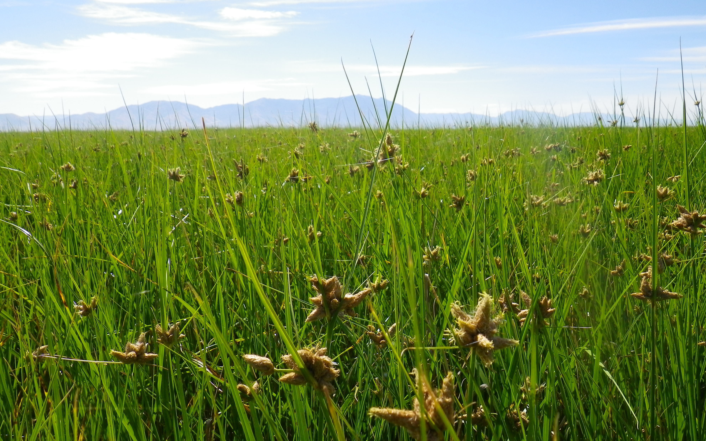

```{r setup, include = FALSE, echo=FALSE, message=FALSE, warning=FALSE}
library(shiny)
library(flexdashboard)
library(fontawesome)
library(leaflet)
library(tidyr)
library(dplyr)
library(ggplot2)
library(sf)
library(kableExtra)
library(scales)
library(DT)
library(httr)
library(jsonlite)

# API Configuration
API_BASE_URL <- "https://postgrest-seamlessgeolmap-734948684426.us-central1.run.app"
API_SCHEMA <- "wetlands"

# Cache environment for storing API responses
api_cache <- new.env()

# Function to fetch data from PostgREST API with fallback to CSV
fetch_data <- function(table_name, csv_filename = NULL) {
  # Check cache first
  cache_key <- paste0("wetdash_", table_name)
  if (exists(cache_key, envir = api_cache)) {
    cat("Using cached data for", table_name, "\n")
    return(get(cache_key, envir = api_cache))
  }
  
  # Try API first
  tryCatch({
    url <- paste0(API_BASE_URL, "/wetdash_", table_name)
    
    response <- GET(
      url,
      add_headers("Accept-Profile" = API_SCHEMA),
      timeout(30)
    )
    
    status <- status_code(response)
    
    if (status == 200) {
      cat("✅ Successfully fetched", table_name, "from API\n")
      data <- fromJSON(content(response, "text", encoding = "UTF-8"))
      
      # Convert to data frame if it's a list
      if (is.list(data) && !is.data.frame(data)) {
        data <- as.data.frame(data)
      }
      
      # Store source info for status display
      attr(data, "data_source") <- "API"
      
      # Cache the result
      assign(cache_key, data, envir = api_cache)
      return(data)
    } else if (status == 401) {
      cat("🔒 API returned 401 Unauthorized for", table_name, "- falling back to CSV\n")
      stop("API Unauthorized")
    } else {
      cat("⚠️ API returned status code:", status, "for", table_name, "\n")
      stop("API request failed with status: ", status)
    }
  }, error = function(e) {
    # Fallback to CSV
    csv_file <- if (is.null(csv_filename)) paste0(table_name, ".csv") else csv_filename
    
    if (file.exists(csv_file)) {
      cat("📁 Using CSV fallback for", table_name, ":", csv_file, "\n")
      if (grepl("401|Unauthorized", e$message)) {
        cat("   Reason: API access restricted for this table\n")
      } else {
        cat("   Reason:", e$message, "\n")
      }
      data <- read.csv(csv_file)
      
      # Store source info for status display
      attr(data, "data_source") <- "CSV"
      
      # Cache the CSV data too
      assign(cache_key, data, envir = api_cache)
      return(data)
    } else {
      stop("Both API and CSV fallback failed for ", table_name, ": ", e$message)
    }
  })
}

# Function to clear cache if needed
clear_cache <- function() {
  rm(list = ls(envir = api_cache), envir = api_cache)
  cat("Cache cleared\n")
}

# Load all data using the new fetch function
cat("Loading data from API with CSV fallback...\n")

site_attr <- fetch_data("site_attr")
flags <- fetch_data("flags")
inverts <- fetch_data("inverts")
invert_taxon <- fetch_data("invert_param")
soil <- fetch_data("soil")
soil_param <- fetch_data("soil_param")
water <- fetch_data("water")
water_param <- fetch_data("water_param")

cat("Data loading complete!\n")

# Optional: Add a reactive function to refresh data
refresh_data <- function() {
  clear_cache()
  
  # Reload all data
  site_attr <<- fetch_data("site_attr")
  flags <<- fetch_data("flags")
  inverts <<- fetch_data("inverts")
  invert_taxon <<- fetch_data("invert_param")
  soil <<- fetch_data("soil")
  soil_param <<- fetch_data("soil_param")
  water <<- fetch_data("water")
  water_param <<- fetch_data("water_param")
  
  cat("Data refreshed!\n")
}

# Commented out CSV loading (keep as backup reference)
# site_attr <- read.csv('site_attr.csv')
# flags <- read.csv('flags.csv')
# inverts <- read.csv('inverts.csv')
# invert_taxon <- read.csv('invert_param.csv')
# soil <- read.csv('soil.csv')
# soil_param <- read.csv('soil_param.csv')
# water <- read.csv('water.csv')
# water_param <- read.csv('water_param.csv')

#veg <- read.csv('veg.csv')
#veg_param <- read.csv('veg_param.csv')

#disturb <- read.csv('disturb.csv')
#disturb_param <- read.csv('disturb_param.csv')

#structure <- read.csv('structure.csv')
#structure_param <- read.csv('structure_param.csv')
```

```{r setup for pgadmin, eval=FALSE, include=FALSE}
#packages
library(DBI)

#database connection
con <- dbConnect(RPostgres::Postgres(), 
                    dbname = 'wet_dash', 
                    port = 5432, 
                    user = 'postgres', 
                 password = 'postgres') 

site_attr <- dbGetQuery(con, 'SELECT * FROM site_attr')
flags <- dbGetQuery(con,  'SELECT * FROM flags')

inverts <- dbGetQuery(con, "SELECT * FROM inverts") 
invert_param <- dbGetQuery(con, 'SELECT * FROM invert_param')

soil <- dbGetQuery(con, "SELECT * FROM soil")
soil_param <- dbGetQuery(con, "SELECT * FROM soil_param")

water <- dbGetQuery(con, 'SELECT * FROM water')
water_param <- dbGetQuery(con, 'SELECT * FROM water_param')

veg <- dbGetQuery(con, "SELECT * FROM veg")
veg_param <- dbGetQuery(con, 'SELECT * FROM veg_param')

disturb <- dbGetQuery(con, 'SELECT * FROM disturb')
disturb_param <- dbGetQuery(con, 'SELECT * FROM disturb_param')

structure <- dbGetQuery(con, 'SELECT * FROM structure')
structure_param <- dbGetQuery(con, 'SELECT * FROM structure_param')
dbDisconnect(con)
```

```{r, subpop munge}
huc_map <- list(
  `Upper Bear` = c(16010101, 16010101),
  `Lower Bear` = c(16010201, 16010202, 16010203, 16010204), 
  Weber = c(16020102,16020101),
  Jordan = c(16020201, 16020202, 16020203, 16020204),
  `Great Salt Lake` = c(16020301, 16020302, 16020303, 16020304, 16020305, 16020306, 
                        16020307, 16020308, 16020309, 16020310), 
  `Sevier Lake` = c(16030001, 16030002, 16030003, 16030004, 16030005, 16030006, 
                    16030007, 16030008, 16030009), 
   `Lower Green` = c(14060001, 14060002, 14060003, 14060004, 14060005, 14060006, 
                     14060007, 14060008, 14060009)
)
reverse_huc <- unlist(lapply(names(huc_map), function(k) setNames(rep(k, length(huc_map[[k]])), huc_map[[k]])))
site_attr <- site_attr %>% mutate(huc8 = recode(huc8, !!!reverse_huc))

wet_map <- list(
  `Aquatic Bed` = c("L1AB", "L2AB", "PAB", "R2AB"), 
  `Marsh` = c('L2EM', "PEM"), 
  `Woody` = c("PSS", "PFO"), 
  `Playa/Mudflat` = c('L1UB', "L2UB", "L2US", "PUB", "PUS", 
                      "R2UB", 'R3UB', 'R4UB', "R5UB", 
                      'R2US', 'R3US', 'R4US', 'R5UB')
)
reverse_wet <- unlist(lapply(names(wet_map), function(k) setNames(rep(k, length(wet_map[[k]])), wet_map[[k]])))
site_attr <- site_attr %>% mutate(sysclass = recode(sysclass, !!!reverse_wet))
```

Background
======================================
Row
--------------------------------------

### Water Chemistry Records
```{r background info}
water_sample <- format(length(water$site_param), big.mark = ',')
valueBox(water_sample, icon = 'fa-tint', color = 'aqua')
```

### Soil Records
```{r}
soil_sample <- format(length(soil$site_param), big.mark = ',')
valueBox(soil_sample, icon = 'fa-map-pin', color = 'green')
```

### Macroinvertebrate Samples
```{r}
invert_sample <- format(length(unique(inverts$siteid)), big.mark = ',')
valueBox(invert_sample, icon = 'fa-bug', color = 'purple')
```

Row
---------------------------------------
### Data Explanation

An explanation of the projects the data was gathered for. Perhaps Links to documents. Contact Information.

```{r explain text}

```

Row
---------------------------------------
### Example Photo
```{r example photo, fig.cap = 'Emergent marsh near Great Salt Lake'}

```

Row
------------------------------------------
### Definitions
A **Watershed** (here HUC6/ Accounting Units) has a definition and you can look at their boundaries [here](https://www.arcgis.com/home/item.html?id=5bbefdcd2511472ea9abd0afedb85c7e)
We have many ways of categorizing wetlands into different types based on how long they are flooded, their position in the landscape, or their dominant plant community. We will use [Cowardin](https://www.fws.gov/media/national-wetland-inventory-wetlands-and-deepwater-map-code-diagram) Systems (palustrine, lacustrine, etc) and Classes (substrate/vegetation type). 
Level III **ecoregions** divided up large areas based on having similar climate and habitats. They were developed by the [EPA](https://www.epa.gov/eco-research/ecoregions) to explain some things. 

### Data Source Status
```{r data source status}
renderText({
  # Check if any data came from API (cached data will have been fetched from API initially)
  api_tables <- c("site_attr", "flags", "inverts", "invert_param", "soil", "soil_param", "water", "water_param")
  cached_count <- length(ls(envir = api_cache))
  
  if (cached_count > 0) {
    paste("✓ Data loaded successfully.", cached_count, "tables cached.")
  } else {
    "⚠ Using fallback CSV data."
  }
})

# Optional: Add a refresh button
actionButton("refresh_data", "Refresh Data", class = "btn-sm")

observeEvent(input$refresh_data, {
  tryCatch({
    refresh_data()
    showNotification("Data refreshed successfully!", type = "message")
  }, error = function(e) {
    showNotification(paste("Refresh failed:", e$message), type = "error")
  })
})
```

Water Chemistry
==========================================
Water chemistry falls into three categories of interest: pollution indicators, nutrients, and toxics. 
select Input for category
select Input for parameter
Text explaining the significance of a value and the wqs associated with that indicator for 3D Aquatic Life Uses

Row {data-height=100}
-------------------------------------------

```{r, water dropdowns}
selectInput('water_category',  'Water Quality Category', 
            choices = list('Pollution Indicators' = 'polind', 'Nutrients' = 'nuts','Toxics' = 'toxs'), 
            selected = 'polind')

params_water_measure <- list(
  'polind' = c('do_conc', 'do_sat', 'ec25', 'temp', 'ph'), 
  'nuts' = c('cbod', 'nh4_t', 'no3_t', 'po4_t', 'nh4_d', 'no3_d', 'po4_d'), 
  'toxs' = c('hg_t', 'al_t', 'as_t', 'ba_t', 'be_t', 'cd_t', 'cr_t', 'cu_t', 'mn_t', 'ni_t', 'pb_t', 
             'se_t', 'zn_t')
)

uiOutput('h2o_param')

renderUI({
  req(input$water_category)
  
  choices <- switch(input$water_category, 
                    'polind' = c('Dissolved oxygen (mg/L)' = 'do_conc', 'Dissolved oxgyen (%)' = 'do_sat', 
                         'Conductivity (us/m)' = 'ec25', 'Temperature (C)' = 'temp', 'pH' = 'ph'), 
                    'nuts' = c('Biological Oxygen Demand' = 'cbod', 'Ammonium (total)' = 'nh4_t', 
                       'Nitrate (total)' = 'no3_t', 'Phosphate (total)' = 'po4_t', 
                       'Ammonium (dissolved)' = 'nh4_d', 'Nitrate (dissolved)' = 'no3_d', 
                       'Phosphate (dissolved)' = 'po4_d'), 
                    'toxs' = c('Mercury' = 'hg_t', 'Aluminum' = 'al_t', 'Arsenic' = 'as_t', 
                               'Barium' = 'ba_t', 'Beryllium' = 'be_t', 'Cadmium' = 'cd_t', 
                               'Chromium' = 'cr_t', 'Copper' = 'cu_t', 'Manganese' = 'mn_t', 
                               'Nickel' = 'ni_t', 'Lead' = 'pb_t', 'Selenium' = 'se_t', 
                               'Zinc' = 'zn_t')
  )
  label <- 'Parameter'
  #option for a label line
  selectInput('h2o_param', label = label, choices = choices)
})
```

```{r}
selectInput('subpop', 'Subpopulation', 
            choices = list('Watershed' = 'huc8', 'Ecoregion' = 'ecoregion', 'Wetland Type' = 'sysclass'), 
            selected = 'huc8')
```

Row
--------------------------------------------
### Map of parameter of interest 

```{r, water map}
#{data-height=2000}
water <- left_join(water, site_attr %>% select(siteid, latitude, longitude, ecoregion, huc8, sysclass)) %>% 
  filter(!is.na(longitude) & !is.na(latitude)) %>% 
    st_as_sf(coords = c('longitude', 'latitude')) %>% 
    st_set_crs(4326)

filtered <- reactive({
  req(input$h2o_param)
  water %>% 
    filter(parameter == input$h2o_param)
  })

renderLeaflet({
  data <- filtered()
  req(nrow(data) > 0)
  data <- left_join(data, water_param %>% select(parameter, units), by = 'parameter')

  pal <- colorNumeric(palette = 'plasma', domain = data$value, reverse = TRUE)
  chart_info <- subset(water_param, parameter == unique(data$parameter))
  chart_title <- paste0(chart_info$definition[1], ' (', chart_info$units[1], ')')

  leaflet(data = data) %>% 
    addProviderTiles(providers$CartoDB.Positron) %>% 
    addCircleMarkers(color = ~pal(value), 
                       fillOpacity = 1,  stroke = 1, 
                     label = ~paste0(value, ' ', units)) %>% 
                     #label = ~as.character(value)) %>% 
                     #label = paste0(~(value), ' (', chart_info$units, ')')) %>% 
      addLegend(pal = pal, values = data$value, 
                position = 'bottomright', opacity = 1, 
                title = chart_title)
})

```

Row
--------------------------------------------
### Histogram of parameter 
```{r}
# {data-height=2000}
subpop <- reactive({
  req(input$subpop)
  
  filtered() %>% 
    mutate(subpop = .data[[input$subpop]]) %>% 
    select(siteid, parameter, value, subpop)
  })

renderPlot({ 
  req(subpop())
  data_hist <- subpop()
  chart_info <- subset(water_param, parameter == unique(data_hist$parameter))
  chart_title <- paste0(chart_info$definition[1], ' ', chart_info$units[1])
  
  ggplot(data_hist, aes(x = value, fill = subpop)) + 
      geom_histogram(bins = 10, color = 'gray20') + 
    scale_fill_brewer(palette = 'Paired', name = input$subpop) +   
      scale_x_continuous(label = scales::comma) + 
      labs(x = chart_title,
           y = 'Frequency') + 
      theme_minimal()
    })
```
  
Row
---------------------------------------------
### Boxplot of parameter

```{r, water boxplot}
# {data-height=2000}
renderPlot({
  req(subpop())
  data_box <- subpop()
  chart_info <- subset(water_param, parameter == unique(data_box$parameter))
  chart_title <- paste0(chart_info$definition[1], ' ', chart_info$units[1])
    ggplot(data_box, aes(x = subpop, y = value, fill = subpop)) + 
      geom_boxplot(alpha = 0.9) + geom_jitter(width = 0.1, alpha = 0.8) + 
      scale_fill_brewer(palette = 'Paired', name = NULL) + 
      guides(fill = 'none') +
      labs(x = NULL, y = chart_title) + 
      scale_x_discrete(labels = function(x){sub('\\s', '\n', x)}) + 
      scale_y_continuous(label = comma) + 
      theme_minimal()
  })
```

Row
--------------------------------------------
### Tabular output of parameter
```{r}
renderDataTable({ 
  table_df <- subpop()
  table_df <- table_df %>% group_by(subpop) %>% 
      summarise(
        Samples = n(), 
        Minimum = min(value, na.rm = TRUE), 
        Mean = mean(value, na.rm = TRUE), 
        Median = median(value, na.rm = TRUE), 
        Maximum = max(value, na.rm = TRUE)
      ) 
  table_df <- as.data.frame(table_df) %>% select(subpop:Maximum) %>% 
    mutate(across(where(is.numeric), ~signif(., 2)))
  datatable(table_df,
    rownames = FALSE)
})
```

Row
-----------------------------------
### Download Water Data {figure-height=100}

```{r, download water, fig.height=0.5}
# Conditionally remove X column if it exists
water_clean <- if("X" %in% names(water)) select(water, -X) else water
water_param_clean <- if("X" %in% names(water_param)) select(water_param, -X) else water_param
for_download <- left_join(water_clean, water_param_clean, by = 'parameter')

downloadButton('download_data', 'Download Water Data')

selectInput('water_download',  'Water Download', 
            choices = list('Pollution Indicators' = 'polind', 'Nutrients' = 'nuts','Toxics' = 'toxic', 
                           'General Chemistry' = 'genchem'), 
            multiple = TRUE, label = 'Select a group to download')

filtered_water_data <- reactive({
  req(input$water_download)
  for_download %>% 
    filter(category == input$water_download)
})

downloadHandler(
  filename = function(){
    paste0('wetland_waterchem', Sys.Date(), '.csv')
  }, 
  content = function(file) {
    write.csv(filtered_water_data(), file, row.names = FALSE)
  }
)
```

Soil Chemistry
========================================
Soils are often more representative of the chemistry/environment of a wetland because they are always present, where water comes and goes. However, clear soil contaminant standards are not as widespread as water quality standards. 

Row {data-height=100}
-------------------------------------------

```{r, soil parameter picker}
soil <- soil %>% 
  mutate(category = case_when(
    parameter %in% c("nh4n_s", "no3n_s", "nh4n_e", "no3n_e", "po4p_s", "orgmat_s", 'ec_s', 'ph_s') ~ 'gennuts', 
    parameter %in% c("ba_s", "al_s", "as_s", "b_s", "ca_s", "cd_s", "co_s", "cr_s", "cu_s", "fe_s", 
                     "k_s", "pb_s", "mg_s", "mn_s", "mo_s", "na_s", "ni_s", "p_s", "s_s", "se_s", 
                     "sr_s", "zn_s", "hg_s") ~ 'ipms')
    )

selectInput('soil_category',  'Soil Chemistry Category', 
            choices = list('General and Nutrients' = 'gennuts', 'Element Scan' = 'ipms'), 
            selected = 'gennuts')

uiOutput('soil_param')

renderUI({
  req(input$soil_category)
  
  choices <- switch(input$soil_category, 
                    'gennuts' = c('Ammonium' = "nh4n_s", 'Nitrate' = "no3n_s", 'Ammonium (KCl)' = "nh4n_e", 
                                  'Nitrate (KCl)' = "no3n_e", 'Phosphate' = "po4p_s", 
                                  'Organic Matter' = "orgmat_s", 'Conductivity' = 'ec_s', 'pH' = 'ph_s'), 
                    'ipms' = c('Barium' = "ba_s", 'Aluminum' = "al_s", 'Arsenic' = "as_s", 'Boron' = "b_s", 
                               'Calcium' = "ca_s", 'Cadmium' = "cd_s", 'Cobalt' = "co_s", 'Chromium' = "cr_s", 
                               'Copper' = "cu_s", 'Iron' = "fe_s", 'Potassium' = "k_s", 'Lead' = "pb_s", 
                               'Magnesium' = "mg_s", 'Manganese' = "mn_s", 'Molybdenum' = "mo_s", 'Sodium' = "na_s", 
                               'Nickel' = "ni_s", 'Phosphorus' = "p_s", 'Sulfur' = "s_s", 'Selenium' = "se_s",
                               'Strontium' = "sr_s", 'Zinc' = "zn_s", 'Mercury' = "hg_s")
  )
  label <- 'Parameter'
  #option for a label line
  selectInput('soil_param', label = label, choices = choices)
})

selectInput('subpop_soil', 'Subpopulation', 
            choices = list('Watershed' = 'huc8', 'Ecoregion' = 'ecoregion', 'Wetland Type' = 'sysclass'), 
            selected = 'huc8')
```

Row
---------------------------------------
### Map of parameter of interest
```{r soil map}
soil <- left_join(soil, site_attr %>% select(siteid, latitude, longitude, ecoregion, huc8, sysclass), by = 'siteid') %>% 
  filter(!is.na(longitude) & !is.na(latitude)) %>% 
    st_as_sf(coords = c('longitude', 'latitude'), crs = 4326) 

filtered_soil <- reactive({
  req(input$soil_param)
  soil %>% 
    filter(parameter == input$soil_param)
  })

renderLeaflet({
  data_soil <- filtered_soil()
  req(nrow(data_soil) > 0)

  pal <- colorNumeric(palette = 'plasma', domain = data_soil$value, reverse = TRUE)
  chart_info_soil <- subset(soil_param, parameter == unique(data_soil$parameter))
  chart_title_soil <- paste0(chart_info_soil$definition[1], ' (', chart_info_soil$units[1], ')')

  leaflet(data = data_soil) %>% 
    addProviderTiles(providers$CartoDB.Positron) %>% 
    addCircleMarkers(color = ~pal(value), 
                       fillOpacity = 1,  stroke = TRUE, 
                     label = ~as.character(value)) %>% 
      addLegend(pal = pal, values = data_soil$value, 
                position = 'bottomright', opacity = 1, 
                title = chart_title_soil)
})
```

Row
----------------------------------------
### Histogram of parameter
```{r, soil histogram}
subpop_soil <- reactive({
  req(input$subpop_soil)
  
  filtered_soil() %>% 
    mutate(subpop = .data[[input$subpop_soil]]) %>% 
    select(siteid, parameter, value, subpop)
  })

renderPlot({ 
  req(subpop_soil())
  data_hist_soil <- subpop_soil()
  chart_info_soil <- subset(soil_param, parameter == unique(data_hist_soil$parameter))
  chart_title_soil <- paste0(chart_info_soil$definition[1], ' ', chart_info_soil$units[1])
  
  ggplot(data_hist_soil, aes(x = value, fill = subpop)) + 
      geom_histogram(bins = 10, color = 'gray20') + 
      scale_fill_brewer(palette = 'Paired', 
                           name = NULL) + 
      scale_x_continuous(label = scales::comma) + 
      labs(x = chart_title_soil,
           y = 'Frequency') + 
      theme_minimal()
    })
```

Row
------------------------------------------
### Boxplot of parameter
```{r, soil boxplot}
renderPlot({
  req(subpop_soil())
  data_box_soil <- subpop_soil()
  chart_info_soil <- subset(soil_param, parameter == unique(data_box_soil$parameter))
  chart_title_soil <- paste0(chart_info_soil$definition[1], ' ', chart_info_soil$units[1])
    ggplot(data_box_soil, aes(x = subpop, y = value, fill = subpop)) + 
      geom_boxplot(alpha = 0.9) + geom_jitter(width = 0.1, alpha = 0.8) + 
      scale_fill_brewer(palette = 'Paired') + 
      guides(fill = 'none') +
      labs(x = '', y = chart_title_soil) + 
      scale_x_discrete(labels = function(x){sub('\\s', '\n', x)}) + 
      scale_y_continuous(label = comma) + 
      theme_minimal()
  })
```

Row
---------------------------------------
### Tabular output of parameter 

```{r, soil table}
renderDataTable({ 
  table_df_soil <- subpop_soil()
  table_df_soil <- table_df_soil %>% group_by(subpop) %>% 
      summarise(
        Samples = n(), 
        Minimum = min(value, na.rm = TRUE), 
        Mean = mean(value, na.rm = TRUE), 
        Median = median(value, na.rm = TRUE), 
        Maximum = max(value, na.rm = TRUE)
      ) 
  table_df_soil <- as.data.frame(table_df_soil) %>% select(subpop:Maximum) %>% 
    mutate(across(where(is.numeric), ~signif(., 2)))
  datatable(table_df_soil,
    rownames = FALSE)
})
```

Row
-----------------------------------------
### Download Soil Data

```{r, download soil}
# Conditionally remove X column if it exists
soil_clean <- if("X" %in% names(soil)) select(soil, -X) else soil
soil_param_clean <- if("X" %in% names(soil_param)) select(soil_param, -X) else soil_param
for_download_soil <- left_join(soil_clean, soil_param_clean, by = 'parameter')

downloadButton('download_data', 'Download Water Data')

selectInput('soil_download',  'Soil Download', 
            choices = list('General and Nutrients' = 'gennuts', 'Element Scan' = 'ipms'), 
            multiple = TRUE, label = 'Select a group to download')

filtered_soil_data <- reactive({
  req(input$soil_download)
  for_download_soil %>% 
    filter(category == input$soil_download)
})

downloadHandler(
  filename = function(){
    paste0('wetland_soilchem', Sys.Date(), '.csv')
  }, 
  content = function(file) {
    write.csv(filtered_soil_data(), file, row.names = FALSE)
  }
)
```

Wetland Macroinvertebrates
=======================================
Macroinvertebrates (definition) are awesome. However, much like water, it is not always possible to sample benthic macroinvertebrates because the benthos disappears when water retreats. 


```{r invert data munge}
inverts <- inverts %>% 
  filter(!site_taxa %in% flags$site_param) #remove vertebrates from sample

invert_metrics <- inverts %>% group_by(siteid) %>% 
  summarise(
    richness = n(), 
    abundance = sum(abundance), 
    .groups = 'drop' #what does this piece do?
  )

eto_taxa <- invert_taxon %>% 
  filter(order %in% c('Ephemeroptera', 'Tricoptera', 'Odonata'))
  
eto_data <- inverts %>% 
  filter(taxon %in% eto_taxa$taxon) %>% 
  group_by(siteid) %>% 
  summarise(
    eto_raw = sum(abundance), .groups = 'drop'
  )

invert_metrics <- invert_metrics %>% 
  left_join(eto_data, by = 'siteid') %>% 
  mutate(
    eto_raw = replace_na(eto_raw, 0), 
    eto_rel = eto_raw / abundance
  )

invert_metrics_long <- invert_metrics %>% 
  select(-eto_raw) %>% 
  pivot_longer(
    cols = -siteid, 
    names_to = 'parameter', 
    values_to = 'value'
)

#relative abundance by feeding group, bug type, and arthropod order
feed_group <- inverts %>% 
  left_join(invert_taxon %>% select(taxon, feed_group), by = 'taxon') %>% 
  group_by(siteid, feed_group) %>% 
  summarise(
    abund = sum(abundance), .groups = 'drop') %>% 
  pivot_wider(names_from = feed_group, values_from = abund, values_fill = 0) %>% 
  left_join(select(invert_metrics, siteid, abundance), by = 'siteid') %>% 
  mutate(across(-c(siteid, abundance), ~ .x / abundance)) %>% #this is important for shortening
  select(-abundance) %>% 
  pivot_longer(
    cols = -siteid, 
    names_to = 'group', 
    values_to = 'rel_abnd') %>% 
  mutate(parameter = 'feed_grp')

group_taxa <- select(invert_taxon, taxon, group)

bug_type <- inverts %>% 
  left_join(group_taxa, by = 'taxon') %>% 
  group_by(siteid, group) %>% 
  summarise(
    abund = sum(abundance), .groups = 'drop') %>% 
  pivot_wider(names_from = group, values_from = abund, values_fill = 0) %>% 
  left_join(select(invert_metrics, siteid, abundance), by = 'siteid') %>% 
  mutate(across(-c(siteid, abundance), ~ .x / abundance)) %>% 
  select(-abundance) %>% 
  pivot_longer(
    cols = -siteid, 
    names_to = 'group', 
    values_to = 'rel_abnd') %>% 
  mutate(parameter = 'bug_type') #when to use mutate function
 
group_map <- list(
  Snails = c('snail', 'spring_snail', 'mud_snail'), 
  Beetles = c('aquat_beetle', 'leaf_beetle', 'diving_beetle', 'riffle_beetle'), 
  Midges = c('biting_midge', 'midge'), 
  Flies = c('fly', 'cranefly'), 
  Mayflies = ('mayfly'), 
  Waterbugs = c('waterbug', 'boatmen', 'backswimmer'), 
  Amphi_Isopods = c('amphipod', 'isopod'), 
  Worms = c('leech', 'worm', 'tuficid_worm', 'flatworm'), 
  Damsel_Dragonflies = c('damselfly', 'dragonfly'),
  Mites = ('mite'),
  Other = c('caterpillar', 'dobsonfly', 'mosquito', 'springtail', 'caddisfly', 'mussel', 'nematod', 'pea_clam')
)
reverse_map <- unlist(lapply(names(group_map), function(k) setNames(rep(k, length(group_map[[k]])), group_map[[k]])))

bug_type <- bug_type %>% 
  mutate(group = recode(group, !!!reverse_map))

arthro_orders <- invert_taxon %>%
  filter(phylum == "Arthropoda") %>%
  select(taxon, order)

arthro_data <- inverts %>%
  filter(taxon %in% arthro_orders$taxon) %>%
  left_join(arthro_orders, by = "taxon") %>%
  group_by(siteid, order) %>%
  summarise(abund = sum(abundance), .groups = 'drop') %>%
  pivot_wider(names_from = order, values_from = abund, values_fill = 0) %>%
  left_join(select(invert_metrics, siteid, abundance), by = "siteid") %>%
  mutate(across(-c(siteid, abundance), ~ .x / abundance)) %>%
  select(-abundance) %>%
  pivot_longer(
    cols = -siteid,
    names_to = "group",
    values_to = "rel_abnd"
  ) %>%
  mutate(parameter = "arthropod")
#still need to limit the number of groups
#   summarise(
#     Amphipoda = Amphipoda/abundance, 
#     Coleoptera = Coleoptera/abundance, 
#     Diptera = Diptera/abundance, 
#     Ephemeroptera = Ephemeroptera/abundance, 
#     Hemiptera = Hemiptera/abundance, 
#     Isopoda = Isopoda/abundance, 
#     Odonata = Odonata/abundance, 
#     Trichoptera = Trichoptera/abundance, 
#     Trombidiformes = Trombidiformes/abundance
#   )

comm_data <- bind_rows(feed_group, bug_type, arthro_data)

```

Row {data-height=100}
-------------------------------------------

```{r invert data pickers}
selectInput('invert_param',  'Macroinvertebrate Metrics', 
            choices = list('Abundance' = 'abundance', 'Taxa Richness' = 'richness', 
                           'ETO Relative Richness' = 'eto_rel'), 
            selected = 'abundance')

selectInput('subpop_invert', 'Subpopulation', 
            choices = list('Watershed' = 'huc8', 'Ecoregion' = 'ecoregion', 'Wetland Type' = 'sysclass'), 
            selected = 'huc8')
```


Row
---------------------------------------
### Map of parameter of interest

```{r, invert map}
invert_metrics_long <- left_join(invert_metrics_long, site_attr %>% select(siteid, latitude, longitude, ecoregion, huc8, sysclass), by = 'siteid') %>% 
  filter(!is.na(longitude) & !is.na(latitude)) %>% 
    st_as_sf(coords = c('longitude', 'latitude'), crs = 4326) 

invert_param <- data.frame(
  parameter = c('abundance', 'richness', 'eto_rel'),
  definition = c('Macroinvertebrate Abundance', 'Taxon Richness', 'ETO Relative Richness'), 
  units = c('Individual Count', 'Taxa Count', 'ETO % of Total Sample')
)
filtered_invert <- reactive({
  req(input$invert_param)
  invert_metrics_long %>% 
    filter(parameter == input$invert_param)
  })

renderLeaflet({
  data_invert <- filtered_invert()
  req(nrow(data_invert) > 0)

  pal <- colorNumeric(palette = 'plasma', domain = data_invert$value, reverse = TRUE)
  chart_info_invert <- subset(invert_param, parameter == unique(data_invert$parameter))
  chart_title_invert <- paste0(chart_info_invert$definition[1], ' (', chart_info_invert$units[1], ')')

  leaflet(data = data_invert) %>% 
    addProviderTiles(providers$CartoDB.Positron) %>% 
    addCircleMarkers(color = ~pal(value), 
                       fillOpacity = 1,  stroke = TRUE, 
                     label = ~as.character(value)) %>% 
      addLegend(pal = pal, values = data_invert$value, 
                position = 'bottomright', opacity = 1, 
                title = chart_title_invert)
})
```

Row
---------------------------------------
### Histogram of parameter

```{r, invert histogram}
subpop_invert <- reactive({
  req(input$subpop_invert)
  
  filtered_invert() %>% 
    mutate(subpop = .data[[input$subpop_invert]]) %>% 
    select(siteid, parameter, value, subpop)
  })

renderPlot({ 
  req(subpop_invert())
  data_hist_invert <- subpop_invert()
  chart_info_invert <- subset(invert_param, parameter == unique(data_hist_invert$parameter))
  chart_title_invert <- paste0(chart_info_invert$definition[1], ' ', chart_info_invert$units[1])
  
  ggplot(data_hist_invert, aes(x = value, fill = subpop)) + 
      geom_histogram(bins = 10, color = 'gray20') + 
      scale_fill_brewer(palette = 'Paired', 
                           name = NULL) + 
      scale_x_continuous(label = scales::comma) + 
      labs(x = chart_title_invert,
           y = 'Frequency') + 
      theme_minimal()
    })
```

Row
----------------------------------------
### Boxplot of parameter

```{r, invert boxplot}
renderPlot({
  req(subpop_invert())
  data_invert <- subpop_invert()
  chart_info_invert <- subset(invert_param, parameter == unique(data_invert$parameter))
  chart_title_invert <- paste0(chart_info_invert$definition[1], ' ', chart_info_invert$units[1])
    ggplot(data_invert, aes(x = subpop, y = value, fill = subpop)) + 
      geom_boxplot(alpha = 0.9) + geom_jitter(width = 0.1, alpha = 0.8) + 
      scale_fill_brewer(palette = 'Paired', name = NULL) + 
      guides(fill = 'none') +
      labs(x = '', y = chart_title_invert) + 
      scale_x_discrete(labels = function(x){sub('\\s', '\n', x)}) + 
      scale_y_continuous(label = comma) + 
      theme_minimal()
  })

```

Row
---------------------------------------
### Tabular output of parameter

```{r, invert table}
renderDataTable({ 
  table_df_invert <- subpop_invert()
  table_df_invert <- table_df_invert %>% group_by(subpop) %>% 
      summarise(
        Samples = n(), 
        Minimum = min(value, na.rm = TRUE), 
        Mean = mean(value, na.rm = TRUE), 
        Median = median(value, na.rm = TRUE), 
        Maximum = max(value, na.rm = TRUE)
      ) 
  table_df_invert <- as.data.frame(table_df_invert) %>% select(subpop:Maximum) %>% 
    mutate(across(where(is.numeric), ~signif(., 2)))
  datatable(table_df_invert,
    rownames = FALSE)
})
```

Row {data-height=100}
-------------------------------------------

```{r, comm dropdown}
selectInput('invert_comm',  'Community Metrics', 
            choices = list('Feeding Group' = 'feed_grp', 'Bug Type' = 'bug_type', 'Arthropod Order' = 'arthropod'), 
                          selected = 'feed_grp')

selectInput('subpop_comm', 'Subpopulation', 
            choices = list('Watershed' = 'huc8', 'Ecoregion' = 'ecoregion', 'Wetland Type' = 'sysclass'), 
            selected = 'huc8')
```

Row
---------------------------------------------
### Macroinvertebrate Community Plots

```{r, community plot}
comm_data <- comm_data %>% 
  left_join(site_attr %>% select(siteid, ecoregion, huc8, sysclass), by = 'siteid')

filtered_comm <- reactive({
  req(input$invert_comm)
  filter(comm_data, 
         parameter == input$invert_comm)
  })

subpop_comm <- reactive({
  req(input$subpop_comm)
  
  filtered_comm() %>% 
    mutate(subpop = .data[[input$subpop_comm]]) %>% 
    select(siteid, parameter, rel_abnd, group, subpop)
  })
 
renderPlot({
  data_comm <- subpop_comm()
  
   data_comm <- data_comm %>% group_by(group, subpop) %>% 
     summarise(
       rel_abnd = mean(rel_abnd, na.rm = TRUE))
   
   ggplot(data_comm, aes(x = subpop, y = rel_abnd, fill = group)) +
       geom_bar(position = 'stack', stat = 'identity', color = 'grey50') +
       scale_fill_brewer(palette = 'BrBG') +
       labs(x = NULL, y = 'Relative Abundance') +
       scale_x_discrete(labels = function(x){sub('\\s', '\n', x)}) +
       theme_minimal(base_size = 13) #+ 
     #theme(axis.text.x = element_text(angle = 30, hjust = 1))
})
```

Row
------------------------------------
### Macroinvertebrate Data Download

```{r, invert download}
for_download_invert <- pivot_wider(
  inverts, 
  id_cols = siteid, 
  names_from = taxon, 
  values_from = abundance, 
  values_fill = NA
)

for_download_invert <- left_join(for_download_invert, site_attr %>% select(siteid, date, latitude, longitude))

downloadButton('download_data', 'Download Invertebrate Data')

downloadHandler(
  filename = function(){
    paste0('wetland_inverts', Sys.Date(), '.csv')
  }, 
  content = function(file) {
    write.csv(for_download_invert(), file, row.names = FALSE)
  }
)

```

