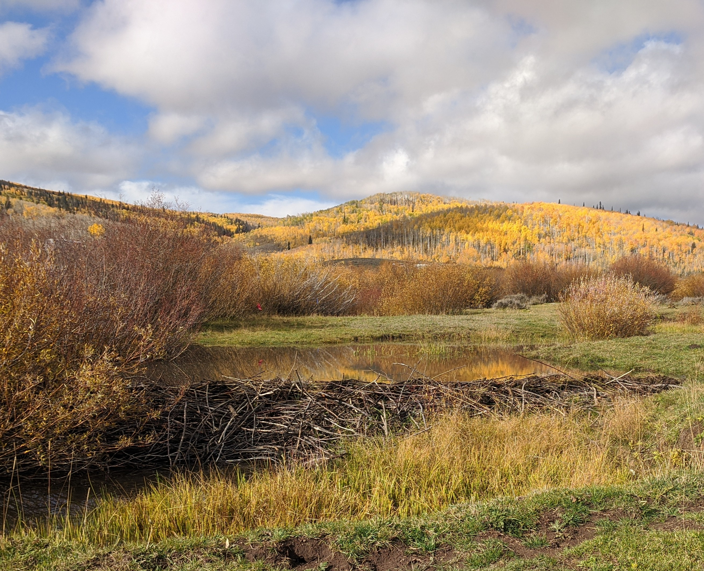
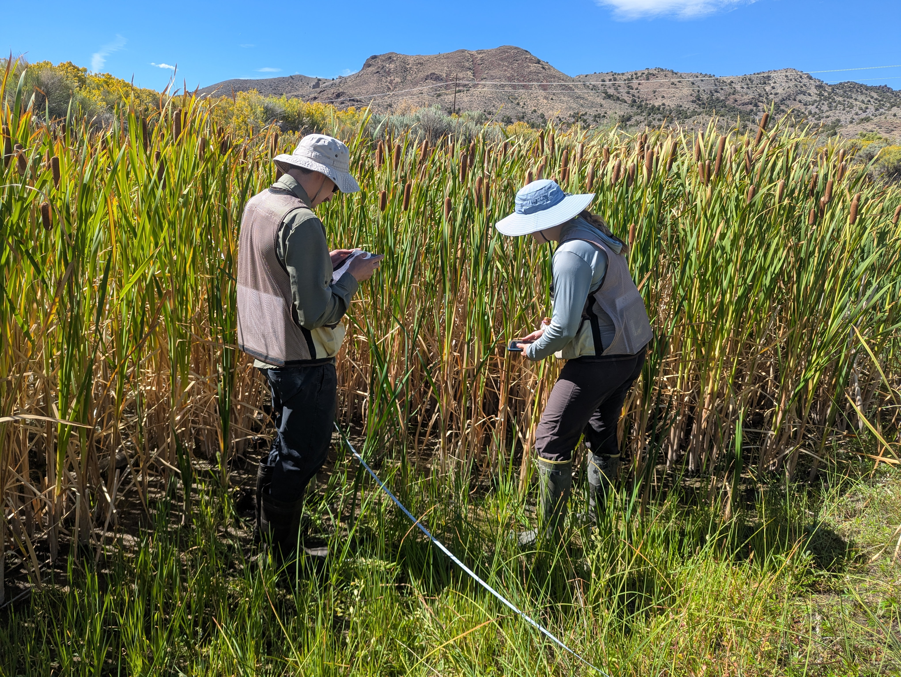
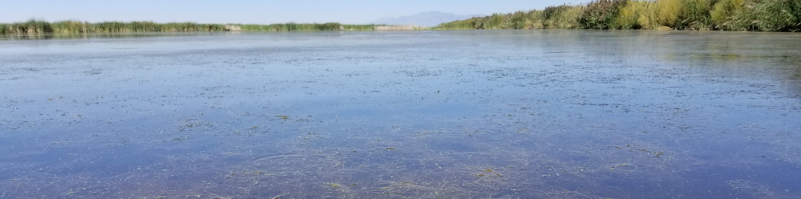
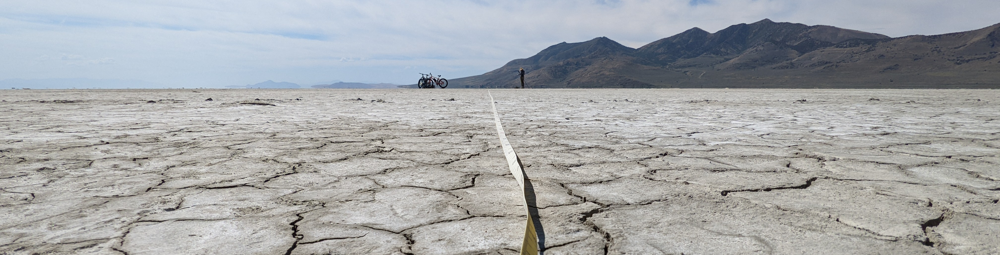

```{r setup}
# R packages required for visualizations
library(shiny)
library(flexdashboard)
library(fontawesome)
library(leaflet)
library(dplyr)
library(tidyr)
library(ggplot2)
library(sf)
library(scales)
library(DT)
library(stringr)
library(httr)
library(jsonlite)

# Source helper functions
source("R/config.R")
source("R/data.R")
source("R/theme.R")
source("R/maps.R")
source("R/charts.R")
source("R/tables.R")
source("R/reactives.R")

# Load all data
site_attr <- fetch_data("site_attr")
flags <- fetch_data("flags")
inverts <- fetch_data("inverts")
invert_taxon <- fetch_data("invert_param")
soil <- fetch_data("soil")
soil_param <- fetch_data("soil_param")
water <- fetch_data("water")
water_param <- fetch_data("water_param")
```

```{r prepare site attributes}
# Add derived columns (Watershed, Wetland Type, organization) and remove blanks
site_attr <- prepare_site_attr(site_attr)
```

```{r tab change handler}
# Invalidate Leaflet map size when switching tabs
# This fixes maps losing their bounds when hidden and re-shown
observeEvent(input$active_tab, {
  tab <- input$active_tab

  # Map each tab to its corresponding leaflet map ID
  map_id <- switch(tab,
    "#section-water-chemistry" = "water_map",
    "#section-soil-chemistry" = "soil_map",
    "#section-macroinvertebrates" = "invert_map",
    NULL
  )

  if (!is.null(map_id)) {
    session$sendCustomMessage("invalidateLeafletMap", map_id)
  }
})
```

```{r download helpers}
# Helper functions for download UI patterns

# Create conditional download button that enables when input has values
create_download_button <- function(output_name, input_name, button_id) {
  output[[output_name]] <- renderUI({
    if (is.null(input[[input_name]]) || length(input[[input_name]]) == 0) {
      tags$button("Download", class = "btn btn-download", disabled = "disabled",
                  style = "margin-top: 25px; opacity: 0.5; cursor: not-allowed;")
    } else {
      downloadButton(button_id, label = 'Download', class = "btn-download",
                     style = "margin-top: 25px;")
    }
  })
}

# Create download handler for CSV export
create_csv_download <- function(handler_name, filename_prefix, data_reactive) {
  output[[handler_name]] <- downloadHandler(
    filename = function() {
      paste0(filename_prefix, '_', Sys.Date(), '.csv')
    },
    content = function(file) {
      write.csv(data_reactive(), file, row.names = FALSE)
    }
  )
}
```

```{r wq criteria}
#create data frame with Utah 3D criteria for water chemistry plots; 80% complete

wqs <- data.frame(
  parameter = c('do_conc', #water$parameter
                'ph',
                'al_d', 
                'as_d', 
                'cd_d', 
                'cr_d', 
                'cu_d', 
                'pb_d', 
                'hg_d', 
                'ni_d', 
                'se_d', 
                'zn_d', 
                'nh4_d'), 
  acute = c(3.0, #acute criteria (or lower boundary for ph), do_conc 
            6.5, #ph lower
            87, #aluminum
            150, #arsenic
            0.72, #cadmium
            11, #chromium hexavalent
            9, #copper
            2.5, #lead
            0.012, #mercury
            52, #nickel
            4.6, #selenium
            120, #zinc
            0.80), #ammonium calculated with mean temp and pH
  chronic = c(5.0, #do_conc
              9.0, #ph upper
              750, #aluminum
              340, #arsenci
              1.8, #cadmium
              16, #chromium hexavalent
              13, #copper
              65, #lead
              0.012, #mercury
              468, #nickel
              18.4, #selenium
              120, #zinc
              0.80) #ammonium
)

water_param <- left_join(water_param, wqs) #add parameters to water_param
```

```{r picture styling}
#styling for inserted figures
insert_figure <- function(
    img_path, 
    caption, 
    alt_text = "") {
  cat(sprintf('
  <div class="figure">
  
  <p class="caption">%s
  </p>
</div>
', 
img_path, alt_text, caption))
}
```

Home <!-- Section Home -->
======================================

Row <!-- home: row 1: intro -->
---------------------------------------
### 
<!-- home row 1 column 1: text -->
<h2> **Welcome to the Utah Wetland Data Explorer!** </h2>
Explore water quality, soil chemistry, and macroinvertebrate communities in Utah’s wetlands!

Utah is home to <a href="https://wetlands.geology.utah.gov/" target="_blank">1.5 million acres of wetlands</a>. Wetlands have three parts: 1) water at or near the soil surface for some part of the year, 2) hydric soils with low oxygen created by flooding, and 3) hydrophytic plants that have adaptations to flooding and hydric soils. Wetlands are rare in Utah, only three percent of the state, but they provide functions that are crucial to healthy watersheds. Wetland functions include:

 - Improving water quality,
 - Buffering communities from drought and flood,
 - Providing habitat for 80% of Utah's fish and wildlife species, and
 - Providing recreation opportunities for paddling, wildlife watching, hunting, and fishing.
 
Wetland hydrology is dynamic, often switching between deep and shallow flooding or no flooding at all. Dynamic hydrology leads to chemical and biological conditions that set wetlands apart from other aquatic ecosystems like lakes and streams. Decades of research, management, and monitoring in Utah wetlands have produced a trove of chemical, physical, and biological data, but that data is often in disparate reports written by multiple sources.This web application provides data compiled from numerous sources and presents information to the public all in one place.

### 
<!-- home row 1 column 2: image -->
<div class="figure">
  
  <p class="figure.caption">Beaver Dam Analog and wetland near Strawberry Reservoir</p>
</div>

Row <!-- home row 2: value boxes describing data -->
--------------------------------------

### Water Records
```{r water value box}
water_sample <- format(length(water$site_param), big.mark = ',')
valueBox(water_sample, icon = 'fa-tint')
```

### Soil Records
```{r soil value box}
soil_sample <- format(length(soil$site_param), big.mark = ',')
valueBox(soil_sample, icon = 'fa-earth-americas')
```

### Macroinvertebrate Samples
```{r invert value box}
invert_sample <- format(length(unique(inverts$siteid)), big.mark = ',')
valueBox(invert_sample, icon = 'fa-bug')
```

Row <!-- Home row 3 data sources -->
------------------------------------------
### 
<!-- Row 3 Column 1: image -->

<div class="figure">
  
  <p class="figure.caption">UGS ecologists monitoring a wetland in Beaver County</p>
</div>

### 
<!-- Row 3 Column 2: text -->
<h3> **Data Sources** </h3>

The bulk of data included here is from samples gathered as part of wetland condition monitoring surveys conducted by the Utah Geological Survey (UGS) and Utah Division of Water Quality. The most common way to measure wetland condition is to assess what types of plants are growing and how much area they cover. Water, soil, and macroinvertebrates provide important clues into factors that drive wetland condition and those samples were gathered alongside plant community monitoring. The existing data is heavily focused around Great Salt Lake, but the UGS hopes to collate more data to paint a full picture of wetland chemistry and biology across Utah. To learn more about data included in this dashboard, check out the resources below:

 - <a href="https://geology.utah.gov/water/wetlands/" target="_blank">The UGS Wetlands Program website</a>
 - <a href="https://geodata.geology.utah.gov/pages/collections_featured.php?parent=665" target = "_blank">The Wetlands collection in the Utah GeoData Archive</a>
 - <a href = "https://wetlandplants.geology.utah.gov/" target = "_blank"> The Utah Wetland Plant Application</a>
 - <a href = "https://wetlands.geology.utah.gov/" target = "_blank"> The Utah Wetland Mapper</a>

```{r data source status, eval=FALSE}
### Data Source Status
#column that showed API tables loaded, remove "eval=FALSE" if you want this back
renderText({
  # Check data sources for each table
  api_tables <- c("site_attr", "flags", "inverts", "invert_param", "soil", "soil_param", "water", "water_param")
  cached_count <- length(ls(envir = api_cache))
  
  if (cached_count > 0) {
    # Check which tables came from API vs CSV
    api_count <- 0
    csv_count <- 0
    
    for (table in api_tables) {
      cache_key <- paste0("wetdash_", table)
      if (exists(cache_key, envir = api_cache)) {
        data_obj <- get(cache_key, envir = api_cache)
        source_type <- attr(data_obj, "data_source")
        if (!is.null(source_type) && source_type == "API") {
          api_count <- api_count + 1
        } else {
          csv_count <- csv_count + 1
        }
      }
    }
    
    if (api_count == cached_count) {
      paste("API Data: All", cached_count, "tables loaded from PostgREST API")
    } else if (csv_count == cached_count) {
      paste("CSV Fallback: All", cached_count, "tables loaded from CSV files")
    } else {
      paste("Mixed Sources:", api_count, "tables from API,", csv_count, "tables from CSV")
    }
  } else {
    "No data loaded"
  }
})

# Optional: Add a refresh button
actionButton("refresh_data", "Refresh Data", class = "btn-sm")

observeEvent(input$refresh_data, {
  tryCatch({
    refresh_data()
    showNotification("Data refreshed successfully!", type = "message")
  }, error = function(e) {
    showNotification(paste("Refresh failed:", e$message), type = "error")
  })
})
```
 
Row <!-- Home Row 4: text data exploration -->
------------------------------------------
### 
<h3> **Ways to Explore the Data** </h3>

The tabs at the top of this page will guide you through visualizations and summaries of water chemistry, soil chemistry, and macroinvertebrate communities found in Utah's wetlands. Data from multiple sources are presented in one place and put into a context to help visualize  how the data could be  used in wetland management, restoration, and research.

- **Maps**: Viewing data spatially can show potential regional differences in wetlands or hotspots where a particular parameter is notably different. Maps can highlight gradients of increasing concentration or diversity. A spatial view also allows users to focus on a region, management area, or particular wetland of interest. Points have been jittered so that repeat samples from the same location can be seen. 
- **Histograms**: These charts show the range of values possible for a measurement as well as what values are most or least common. In histograms, the longest bars show the most common value observed in the data. When a value is less common, the bar will be shorter. 
- **Boxplots**: These plots are a way to compare data across multiple groups. The top and bottom sides of each box mark the 25th and 75th percentiles of observations in that group, whereas the middle bar is the median or middle value. The whiskers on each plot show the maximum and minimum values, and any points above or below those whiskers are considered outliers.
- **Summary statistics**: These values show the details of how a parameter is different between wetland populations of interest for a more exact comparison.  
- **Populations**: The dropdowns at the top of each page allow you to divide data in the plots and tables into different groups.
  - **Watersheds**: The climate, topography, hydrology, and geology of a watershed determine where wetlands are located and what type of wetlands exist there. The United States is divided into <a href = "https://www.arcgis.com/home/item.html?id=5bbefdcd2511472ea9abd0afedb85c7e" target = "_blank">Hydrologic Unit Codes</a> (HUC's), with longer codes (2-12 digits) showing higher resolution of shared water sources. We are showing data in 6-digit Basin codes. 
  - **Ecoregions**: The U.S. is also divided into <a href = "https://www.epa.gov/eco-research/ecoregions" target = "_blank">ecoregions</a>, which are areas that support similar ecosystems because they have the same landforms, climate, biological communities, and land uses. Utah is very ecologically diverse and supports seven Level III ecoregions, from the arid Colorado Plateau to the high elevation Wasatch and Uinta Mountains.
  - **Wetland Type**: Wetlands can be grouped in several ways, here we are lumping them together by their dominant vegetation type, following the classes developed by <a href = "https://www.fws.gov/media/national-wetland-inventory-wetlands-and-deepwater-map-code-diagram" target = "_blank">Cowardin</a> for the U.S. Fish and Wildlife Service. 
- **On Your Own**: A 'Download' button is at the bottom of each tab, where you can download a subset of parameters or all the data. 

Row {data-height = 100} <!-- Home Row 5: footer --> 
------------------------------------------
###  

<div class = 'footer'>
Please consider submitting your data to the Utah Geological Survey for inclusion in the Wetland Data Explorer. Contact Becka Downard at <a href="mailto:beckad@utah.gov">beckad@utah.gov</a> for instructions on how to format and submit your data.</p>
</div>


Water Chemistry <!-- Section: Water --> 
==========================================

Row <!-- Water Row 1: Intro --> 
-------------------------------------------
### 
<!-- Water Row 1 Column 1: intro text --> 
<h2> **Water Chemistry** </h2>
Wetlands are often called landscape sinks—places low in the landscape where water and the contaminants in the water accumulate. Within a wetland, rising and falling water levels, rapid plant growth, and unique soil microbes concentrate, dilute, transform, or sequester chemicals in the water. In fact, water quality can improve as water flows through wetlands. Water chemistry is a crucial indicator of wetland condition because the plants, fish, and macroinvertebrates in the water are adapted to a specific range of chemistry, and deviations outside of those ranges can be clear markers of human impacts on an ecosystem. We have included acute water quality criteria for waters that support waterfowl and shorebirds, <a href = "https://adminrules.utah.gov/public/rule/R317-2/Current%20Rules?" target = "_blank">Class 3D in Utah</a>, where possible as dashed horizontal lines, for context. However, Utah Administrative Rules contain a number of caveats and exclusions for applying water quality standards in wetlands.
 
**Explore the data** by using the drop-down menus to change the data topics and metrics to change the maps and charts below.

Data notes. Of the dozens of water chemistry parameters that can be measured, we present the parameters most indicative of wetland condition: general chemistry, nutrients, and metals/metalloids. Parameters not included in the plots below can be downloaded. For the purpose of clear data visualization we have removed outlier values, but those values are included in the data download.

### 
<!-- Water Row 1 Column 2: image --> 
<div class="figure">
  
  <p class="figure.caption">Submerged aquatic vegetation in a wetland near Great Salt Lake.</p>
</div>

```{r water chem munge}
#add dissolved/total (filtered/unfiltered) fraction column
water_param$fraction <- rep(NA)
water_fraction <- function(fraction){
  sapply(fraction, function(fraction) {
    if(grepl("_t", fraction)) {
      "unfiltered"
    } else if(grepl("_d", fraction)) {
      "filtered"
    }
      else {
        'unfiltered' 
      }
    })
  }
water_param$fraction <- water_fraction(water_param$parameter)

#data changes
## update with new data
water_param$label <- 
  ifelse(water_param$parameter == 'ph', 
         'pH', 
         water_param$label)
water_param$label <- 
  ifelse(water_param$parameter == 'do_sat', 
         'Dissolved Oxygen 2', 
         water_param$label)
water_param$label <- 
  ifelse(water_param$parameter == 'do_conc', 
         'Dissolved Oxygen', 
         water_param$label)
water_param$label <- 
  ifelse(water_param$parameter == 'po4_d', 
         'Phosphate', 
         water_param$label)
water_param$definition <- 
  ifelse(water_param$definition == ' Ammonia as Nitrogen, Filtereded',
         'Ammonia as Nitrogen, Filtered', 
         water_param$definition)
```

Row {data-height=350} <!-- Water Row 2: Dropdowns & text --> 
-------------------------------------------
<!-- Water Row 2 Column 1: dropdowns --> 
<div class="dropdown-container">
  <div class="dropdown-item">
  
```{r water category dropdown WQ1}
selectInput('water_category', #wq1 name
            'Water Quality Category', #wq1 label
            choices = list(
              'General Chemistry' = 'genchem', 
              'Nutrients' = 'nuts', 
              'Metal(oids)' = 'metal'
              ), 
            selected = 'genchem')

uiOutput('h2o_param')
```

</div>
<div class="dropdown-item">

```{r water parameter dropdown WQ2}
renderUI({
  req(input$water_category) #require wq1
  
  choices <- switch(input$water_category, #wq2 options based on wq1 selection
                    #based on water$label, no water$parameter
                    'genchem' = #wq2 options for wq1 genchem (polind category labels)
                      c('Conductivity' = 'Electrical Conductivity',
                        'pH' = 'pH',
                        'Dissolved Oxygen' = 'Dissolved Oxygen',
                        'Temperature' = 'Temperature'), 
                    'nuts' = #wq2 options from wq1 nuts
                      c('Biological Oxygen Demand' = 'Biological Oxygen Demand', 
                        'Ammonia' = 'Ammonia-N', 
                        'Nitrate' = 'Nitrate + Nitrite-N', 
                        'Phosphate' = 'Phosphate'),
                    'metal' = #wq2 options for wq1 metal
                      c('Aluminum' = 'Aluminum', 
                               'Arsenic' = 'Arsenic', 
                               'Barium' = 'Barium', 
                               'Cadmium' = 'Cadmium',
                               'Chromium' = 'Chromium', 
                               'Copper' = 'Copper', 
                               'Lead' = 'Lead', 
                               'Manganese' = 'Manganese',
                               'Mercury' = 'Mercury',
                               'Nickel' = 'Nickel', 
                               'Selenium' = 'Selenium',
                               'Zinc' = 'Zinc')
  )
  label <- 'Parameter'
  selectInput('h2o_param',
              label = label,
              choices = choices,
              selected = unname(choices[1]))
})
```

</div>
<div class="dropdown-item">

```{r water grouping dropdown WQ3}
selectInput(
  'subpop', 'Grouping', 
  choices = list(
    'Watershed' = 'Watershed', 
    'Ecoregion' = 'ecoregion', 
    'Wetland Type' = 'Wetland Type'), 
            selected = 'Watershed')
```

</div>
</div>

### 
<!-- Water Row 2 Column 2: text explanation --> 
```{r text out for WQ2}
htmlOutput('category_description')

output$category_description <- 
  renderUI({
    switch(input$water_category, 
           genchem = HTML("
             <p>General Chemistry parameters describe the basic chemistry of a wetland. Changes in these parameters can indicate changes in water quality. Aquatic organisms are adapted to life within specific ranges of conductivity, pH, and temperature.
 </p>
             <ul>
             <li><strong>Conductivity</strong> is a measure of how salty water is. Water with more salts will have higher measures of conductivity. Utah wetlands vary significantly in conductivity, from freshwater alpine ponds to hypersaline Great Salt Lake playas. </li>
             <li><strong>pH</strong> measures the acidity (pH < 7) or alkalinity (pH > 7) of water. Some pollutants will drive steep changes in pH.</li>
             <li><strong>Dissolved oxygen</strong> is the amount of oxygen available for aquatic animals to breathe. Decomposition of plants and algae associated with excessive nutrient concentration lowers dissolved oxygen in water.</li>
             <li><strong>Temperature</strong> determines which organisms can survive in wetlands because temperature regulates metabolic processes. Temperature also influences water chemistry, especially how much dissolved gases water can hold.</li>
             </ul>
             "), 
           nuts = HTML("
           <p>Nutrients are the compounds plants need to grow and are cycled through the environment between water, soils, plants, and animals. Wetlands are nutrient cycling hotspots because of the chemical reactions that happen where oxygenated water and soils meet anoxic zones. Though they are necessary for life, too much nitrogen, phosphorus, or carbon, including the elements in excess fertilizer runoff, can throw off the balance of an ecosystem, favoring rapidly growing plants and animals.</p>
           <ul>
           <li><strong>Carbon</strong> is the basis for all life and is found in innumerable chemical forms. We measure organic material in wetlands as organic carbon and biological oxygen demand. The first is a measure of how much organic matter is in the water, and the second is a measure of how much microbial energy is needed to decompose that matter.</li>
           <li><strong>Nitrogen</strong> is necessary for making proteins and conducting photosynthesis, and is the element that most often limits plant growth and productivity. Two forms of nitrogen are measured in wetlands: nitrate, which is more common in well-oxygenated water, and ammonia, which is more common in anoxic waters.</li>
           <li><strong>Phosphorus</strong> is required for metabolism and reproduction in plants, and it is a common component of fertilizers as well as human waste. Phosphate (PO<sub>4</sub>) is the most commonly measured form of phosphorus.</li>
          <ul>
          <li><em>*Nutrients are measured both as total or unfiltered concentration and dissolved or filtered fractions.<em></li>
          </ul>
          </li>
           </ul>
           "), 
           metal = HTML("Metals and Metalloids are elements that are naturally found in the Earth's crust and waterways. Human activities like irrigation, manufacturing, and driving vehicles concentrate those elements in waterways. Some metals and metalloids are toxic to wildlife and humans, leading to death and deformities. Others accumulate in animal fats and cause birth defects or death at higher trophic levels. Many elements are critical micronutrients for plants and animals, and only become impactful at high concentrations.</p>
           <ul>
           <li><strong>Arsenic</strong>, <strong>cadmium</strong>, <strong>chromium</strong>, <strong>lead</strong>, and <strong>mercury</strong>  are toxic even at very low concentrations. These elements are highest in waters influenced by industrial discharges and mining. Mercury is of special concern because it bioaccumulates in the food chain.</li>
           <li><strong>Copper</strong>, <strong>nickel</strong>, <strong>selenium</strong>, and <strong>zinc</strong> are used in small amounts by plants and animals. However, high concentrations from improper fertilizer use, industrial pollution, or mining can cause toxicity.</li>
           <li><strong>Aluminum</strong>, <strong>barium</strong>, and <strong>iron</strong>  are all very common in the Earth's crust and usually harmless in the water, but are indicators of geologic processes such as interactions with groundwater or acid mine drainage. At low pH, these elements become more toxic.</li>
           <ul>
          <li><em>*Metals are measured both as total or unfiltered concentration and dissolved or filtered fractions.<em></li>
          </ul>
          </li>
           </ul>
           ")
    )
  })
```

Row {data-height=500} <!-- Water Row 3: map --> 
--------------------------------------------
### Spatial Patterns
```{r water map munge}
#data munge from wq1-wq3
water <- add_spatial_geometry(water, site_attr)

water <-
  left_join(
    water, #combine water + parameter measures
    water_param %>%
      select(parameter, units, label, fraction, acute, chronic))

#remove outliers (z_score >3) for visualization
#IMPORTANT: Do this BEFORE creating the reactive
water <-
  water %>%
  group_by(parameter) %>%
  mutate(
    z_score = (value - mean(value))/sd(value))

outlier_water <-
  subset(water, z_score > 3)

water <-
  subset(water, z_score <= 3)

water <-
  water %>% select(-z_score)

outlier_water <-
  outlier_water %>% select(-z_score)

# Now create the reactive after outlier removal
filtered <-
  reactive({
    req(input$h2o_param) #filter parameter to those in wq1 category
  water %>%
    filter(label == input$h2o_param)
  })
```

```{r water map plot}
# Create base map (renders once)
output$water_map <- renderLeaflet({ create_base_map() })

# Update markers reactively using leafletProxy
observe({
  req(input$h2o_param)
  data <- filtered()
  req(nrow(data) > 0)
  update_water_map("water_map", data, build_legend_title(data))
})

# Render the leaflet output
leafletOutput("water_map")
```

Row <!-- Water Row 4: histogram and boxplot -->
---------------------------------------------
### Parameter Distribution {data-width=550}
<!-- Water Row 4 Column 1: histogram --> 
```{r water histogram}
sample_labs <- c(filtered = 'Filtered', unfiltered = 'Unfiltered')

subpop <- reactive({
  req(input$subpop)
  filtered() %>%
    mutate(subpop = .data[[input$subpop]]) %>%
    select(siteid, parameter, value, fraction, acute, chronic, subpop)
})

render_histogram_plot(subpop, input$subpop, "fraction", sample_labs)
```

### Group Comparison {data-width=550}
<!-- Water Row 4 Column 2: box plot -->
```{r water boxplot}
render_boxplot(subpop, input$subpop)
```

Row {data-height=650} <!-- Water Row 5: summary and download -->
--------------------------------------------
### Summary {data-width=500}

<!-- Water Row 5 Column 1: summary table -->
```{r water summary table}
div(class = "summary-box",
  renderDataTable({
    create_summary_table(subpop(), water_param)
  })
)
```

### Download Water Data {data-width=500}
<!-- Water Row 5 Column 2: download data --> 
```{r water download}
water <- rbind(water, outlier_water)
for_download_water <- water %>%
  select(-any_of(c("X", 'label', 'fraction', 'acute', 'chronic'))) %>%
  left_join(water_param %>% select(parameter, definition, mdl, lrl, method, category), by = 'parameter') %>%
  left_join(flags %>% select(site_param, flag), by = 'site_param') %>%
  left_join(site_attr %>% select(siteid:name), by = 'siteid')
#for_download <- for_download %>% select(oid:value, units, definition:name, ecoregion:`Wetland Type`, geometry)

div(class = "download-box",
    
    #tags$h4("Download Water Data"),
    
    tags$p("Download water quality data in a convenient format for your own analysis, research, or reporting. Choose a category below."),
    
    fluidRow(
      column(6,
            selectInput(
              inputId = 'water_download',
              label = 'Select Group',
              choices = list(
                'General Chemistry' = 'genchem',
                'Nutrients' = 'nuts',
                'Toxics' = 'toxic',
                'Other Data' = 'genchem'
              ),
              multiple = TRUE
            )
      ),
      column(6,
            uiOutput('water_download_button')
      )
    )
)

# Filter data reactively
filtered_water_data <- reactive({
  req(input$water_download)
  for_download_water %>% filter(category %in% input$water_download)
})

# Setup download UI and handler
create_download_button('water_download_button', 'water_download', 'download_data')
create_csv_download('download_data', 'wetland_waterchem', filtered_water_data)
```

Soil Chemistry <!-- Section 3: Soil --> 
========================================

Row <!-- Section Soil Row 1: intro --> 
----------------------------------------------
### 
<!-- Section Soil Row 1 Column 1: text --> 
<h2> **Soil Chemistry** </h2>
Soil is where plants are rooted, where the nutrients they need are stored, and where many of the biogeochemical processes that wetlands perform occur. Wetland soils are different from “upland” soils because flooding depletes oxygen in the soil. In the absence of oxygen, soil microbes transform nitrogen, manganese, sulfur, and compounds to metabolize. Water moves slowly through wetlands, which allows chemicals in the water column to settle out and bind to soils. The accumulation and transformation of chemicals in the soil give a more integrated picture of wetland chemistry than water. Soils are also a more reliable measure of the wetland environment because they are always present, whereas water is not. 

**Explore the data** by using the drop-down menus to change the data topics and metrics to change the maps and charts below.

Two types of soil measures are displayed below: general chemistry measures and nutrients that are the results of individual soil analyses and elemental scan results produced by mass spectrometry analysis. 

###
<div class="figure">
  
  <p class="figure.caption">A salt crust has formed on playa wetland soils near Great Salt Lake</p>
</div>


Row {data-height=350} <!-- Section Soil Row 2: dropdowns and text --> 
-------------------------------------------
<!-- Section Soil Row 2 Column 2: dropdown selectors --> 
<div class="dropdown-container">
  <div class="dropdown-item">
  
```{r soil category dropdown SC1}
soil <- soil %>% 
  mutate(
    category = case_when(
      parameter %in% c("nh4n_s", "no3n_s", "nh4n_e", "no3n_e", "po4p_s", "orgmat_s", 'ec_s', 'ph_s') ~ 
        'gennuts',
      parameter %in% c("ba_s", "al_s", "as_s", "b_s", "ca_s", "cd_s", "co_s", "cr_s", "cu_s", "fe_s", "k_s", "pb_s", "mg_s", "mn_s", "mo_s", "na_s", "ni_s", "p_s", "s_s", "se_s", "sr_s", "zn_s", "hg_s") ~ 
        'ipms')
    )

selectInput(
  'soil_category',  
  'Soil Chemistry Category', 
  choices = list(
    'General and Nutrients' = 'gennuts', 
    'Element Scan' = 'ipms'), 
  selected = 'gennuts')

uiOutput('soil_param')
```

</div>
<div class="dropdown-item">

```{r soil parameter dropdown SC2}
renderUI({
  req(input$soil_category) #sc1
  choices <- switch(
    input$soil_category, 
    'gennuts' = c(
      'Ammonium' = 'nh4n_s', 
      'Nitrate' = 'no3n_s', 
      'Ammonium (KCl)' = 'nh4n_e', 
      'Nitrate (KCl)' = 'no3n_e', 
      'Phosphate' = 'po4p_s', 
      'Organic Matter' = 'orgmat_s', 
      'Conductivity' = 'ec_s', 
      'pH' = 'ph_s'),
    'ipms' = c(
      'Aluminum' = "al_s", 
      'Arsenic' = "as_s", 
      'Barium' = "ba_s", 
      'Boron' = "b_s", 
      'Calcium' = "ca_s", 
      'Cadmium' = "cd_s", 
      'Chromium' = "cr_s", 
      'Cobalt' = "co_s",  
      'Copper' = "cu_s", 
      'Iron' = "fe_s", 
      'Mercury' = "hg_s", 
      'Nickel' = "ni_s",
      'Lead' = "pb_s", 
      'Magnesium' = "mg_s", 
      'Manganese' = "mn_s",
      'Molybdenum' = "mo_s", 
      'Phosphorus' = "p_s", 
      'Potassium' = "k_s", 
      'Selenium' = "se_s", 
      'Sodium' = "na_s",
      'Sulfur' = "s_s", 
      'Strontium' = "sr_s", 
      'Zinc' = "zn_s")
  )
  label <- 'Parameter'

  selectInput('soil_param',
              label = label,
              choices = choices,
              selected = unname(choices[1]))
})
```

</div>
<div class="dropdown-item">

```{r soil subpop dropdown SC3}
selectInput(
  'subpop_soil', 
  'Grouping', 
  choices = list(
    'Watershed' = 'Watershed', 
    'Ecoregion' = 'ecoregion', 
    'Wetland Type' = 'Wetland Type'), 
  selected = 'Watershed')
```

</div>
</div>

###  
<!-- Section Soil Row 2 Column 2: explanation text --> 
```{r soil chem category text}
htmlOutput('category_desc_soil')

output$category_desc_soil <- 
  renderUI({
    switch(input$soil_category, 
           gennuts = HTML("
             <p>General chemistry parameters are the key drivers of which organisms can survive in wetlands, based on tolerance to salinity, alkalinity, and organic matter. Nutrients are the compounds plants need to grow, including elements in fertilizers, and are most accessible to plants in soils. </p>
             <ul>
             <li><strong>pH</strong>measures the acidity (pH < 7) or alkalinity (pH > 7) of soil. Many Utah soils are alkaline due to the prevalence of carbonate rock.</li>
             <li><strong>Conductivity</strong> is a measure of soil salinity. Saline soils are challenging for plants to grow in because they affect the plant's water balance. Many wetland plants have adaptations to survive salty soils.</li>
             <li><strong>Organic matter</strong> is the portion of soil composed of material from organisms in various stages of decomposition. Organic matter builds up in wetland soils because decomposition is slower than in uplands. Soil organic matter provides crucial nutrients for plants and is a form of carbon storage.</li>
             <li><strong>Nitrogen</strong> in soils is more easily accessed by plant roots than nitrogen in water, but is needed for the same cell processes. Nitrate and ammonia forms of nitrogen are both found in wetland soils, but ammonia concentration is often higher because nitrates are converted to other forms in oxygen-depleted conditions.</li>
           <li><strong>Phosphorus</strong> accumulates in wetland soils because it readily binds to sediments. Plants are able to easily access phosphorus in soil for their metabolic needs, but much of it remains bound to soils and is a good indicator of legacy nutrient enrichment.</li>
           </ul>
           "), 
           ipms = HTML("
           <p>Soils reflect the elemental geology of a region, which can be determined using mass spectrometry to measure elemental concentrations in the soil. . The elements that accumulate in soils also reflect longer-term patterns of chemistry as contaminants are bound to and buried in soils.</p>
           <ul>
           <li><strong>Arsenic</strong>, <strong>cadmium</strong>, <strong>copper</strong>, <strong>nickel</strong>, <strong>lead</strong>, <strong>mercury</strong>, <strong>selenium</strong>, and <strong>zinc</strong> are metals and metalloids that indicate a history of contamination from industrial and residential sources. Arsenic and selenium are particularly concerning because they are toxic to wildlife that feed in wetlands.</li>
           <li><strong>Potassium</strong>, <strong>calcium</strong>, <strong>magnesium</strong>, and <strong>sulfur</strong> are important plant macronutrients.</li> 
           <li><strong>Boron</strong>, <strong>copper</strong>, <strong>iron</strong>, <strong>manganese</strong>, <strong>molybdenum</strong>, <strong>nickel</strong>, and <strong>zinc</strong> are critical micronutrients for plants.</li>
           </ul>
           ")
    )
  })
```

Row {data-height=500} <!-- Section Soil Row 3 -- Map --> 
---------------------------------------
### Spatial Patterns

```{r soil data munge}
soil <- add_spatial_geometry(soil, site_attr)

soil <- 
  left_join(
    soil, 
    soil_param %>% select(parameter, units, label))

filtered_soil <- reactive({
  req(input$soil_param)
  soil %>% 
    filter(parameter == input$soil_param)
  })
```

```{r soil map plot}
# Create base map (renders once)
output$soil_map <- renderLeaflet({ create_base_map() })

# Update markers reactively using leafletProxy
observe({
  data_soil <- filtered_soil()
  req(nrow(data_soil) > 0)
  update_map_markers("soil_map", data_soil, build_legend_title(data_soil), "soil_legend")
})

# Render the leaflet output
leafletOutput("soil_map")
```

Row <!-- Section Soil Row 4 - histogram and boxplot --> 
----------------------------------------
<!-- Soil Row 4 Column 1 - histogram --> 
### Parameter Distribution
```{r soil histogram}
subpop_soil <- reactive({
  req(input$subpop_soil)
  filtered_soil() %>%
    mutate(subpop = .data[[input$subpop_soil]]) %>%
    select(siteid, parameter, value, subpop)
})

render_histogram_plot(subpop_soil, input$subpop_soil, vline_col = NULL)
```

### Group Comparison
<!-- Soil Row 4 Column 2 - boxplot -->
```{r soil boxplot}
render_boxplot(subpop_soil, input$subpop_soil, hline_col = NULL)
```

Row {data-height=650} <!-- Section Soil Row 5 - summary & download -->
---------------------------------------
### Summary {data-width=500}
<!-- Soil Row 5 Column 1 - summary table -->

```{r soil table}
div(class = "summary-box",
  renderDataTable({
    create_summary_table(subpop_soil(), soil_param)
  })
)
```


### Download Soil Data {data-width=500}
<!-- Soil Row 5 Column 2 - download soil data --> 
```{r download soil}
for_download_soil <- soil %>%
  select(-any_of(c("X", 'label', 'Column1'))) %>%
  left_join(soil_param %>% select(-any_of(c("X", 'label', 'units'))), by = 'parameter') %>%
  left_join(site_attr %>% select(siteid, project))
div(class = "download-box",
    
    tags$p("Download soil data in a convenient format for your own analysis, research, or reporting. Choose a category below."),
    
    fluidRow(
      column(6,
            selectInput(
              inputId = 'soil_download',
              label = 'Select a group to download',
              choices = list('General and Nutrients' = 'gennuts', 'Element Scan' = 'ipms'), 
              multiple = TRUE
            )
      ),
      column(6,
            uiOutput('soil_download_button')
      )
    )
)

# Filter data reactively
filtered_soil_data <- reactive({
  req(input$soil_download)
  for_download_soil %>% filter(category %in% input$soil_download)
})

# Setup download UI and handler
create_download_button('soil_download_button', 'soil_download', 'download_soil')
create_csv_download('download_soil', 'wetland_soilchem', filtered_soil_data)
```

Macroinvertebrates <!-- Section Macroinvertebrates --> 
=======================================
Row <!-- Section Invert Row 1: intro --> 
---------------------------------------

### 
<!-- Section Invert Row 1 Column 1: text --> 
<h2> **Macroinvertebrates** </h2>

Macroinvertebrates are organisms without internal skeletons that are larger than 0.5 millimeters. Common types of macroinvertebrates found in Utah wetlands include larval insects (midges, flies, dragonflies, etc.), worms, snails, and crayfish. Macroinvertebrates form crucial links in the wetland foodweb, feeding on plants and decomposing material and in turn being eaten by birds, amphibians, and fish. The community data presented here are benthic macroinvertebrates: the community of invertebrates that live in the water. Flying macroinvertebrates and those living on the plants are also important, but much harder to accurately count. The size, diversity, and makeup of benthic macroinvertebrates are indicators of ecosystem health and water quality, though research is still needed to determine which species are the most reliable signals of healthy wetlands.

**Explore the data** using the drop-down menus to change the data topics and metrics to change the maps and charts below.

### 
<!-- Section Invert Row 1 Column 2: picture --> 
<div class="figure">
  
  <p class="figure.caption">An adult damselfly rests on wetland vegetation near Moab. </p>
</div>

```{r invert data munge}
inverts <- inverts %>% 
  filter(!site_taxa %in% flags$site_param) #remove vertebrates from sample

invert_metrics <- 
  inverts %>% group_by(siteid) %>% 
  summarise( #calculate abundance and richness for each site
    richness = n(), 
    abundance = sum(abundance), 
    .groups = 'drop' 
  )

eto_taxa <- invert_taxon %>% 
  filter(order %in% c('Ephemeroptera', 'Tricoptera', 'Odonata'))
  
eto_data <- inverts %>% 
  filter(taxon %in% eto_taxa$taxon) %>% 
  group_by(siteid) %>% 
  summarise(
    eto_raw = sum(abundance), 
    .groups = 'drop'
  )

invert_metrics <- invert_metrics %>% 
  left_join(eto_data, 
            by = 'siteid') %>% 
  mutate(
    eto_raw = replace_na(eto_raw, 0), 
    eto_rel = (eto_raw / abundance)*100
  )

invert_metrics$eto_rel <- round(invert_metrics$eto_rel, 2)
invert_metrics_long <- invert_metrics %>% 
  select(-eto_raw) %>% 
  pivot_longer(
    cols = -siteid, 
    names_to = 'parameter', 
    values_to = 'value'
)
```

Row {data-height=300} <!-- Section Invert Row 2: dropdowns --> 
-------------------------------------------
<!-- Section Invert Row 1 Column 1: dropdowns --> 

<div class="dropdown-container">
  <div class="dropdown-item">

```{r invert parameter dropdown MI1}
selectInput('invert_param',  
            'Macroinvertebrate Metrics', 
            choices = list(
              'Abundance' = 'abundance', 
              'Taxa Richness' = 'richness', 
              'ETO Relative Richness' = 'eto_rel'), 
            selected = 'abundance')
```

</div>
<div class="dropdown-item">

```{r invert grouping dropdown MI2}
selectInput('subpop_invert', 
            'Grouping', 
            choices = list(
              'Watershed' = 'Watershed', 
              'Ecoregion' = 'ecoregion', 
              'Wetland Type' = 'Wetland Type'), 
            selected = 'Watershed')
```

</div>
</div>

### 
<!-- Section Invert Row 2 Column 2: text --> 
```{r invert parameter text}
htmlOutput('invert_desc')

output$invert_desc <- 
  renderUI({
    switch(input$invert_param, 
           abundance = HTML("
             <p><strong>Abundance</strong> is a the total number of macroinvertebrates of any group found in a sample taken by sweeping a net at the soil/water interface. Healthy wetlands have macroinvertebrate communities that are both abundant and diverse. 
           </p>"), 
           richness = HTML("
           <p><strong>Taxa Richness</strong> is a count of all the different types of organisms in a sample. An organism can be identified at many levels, depending on the life stage of the invertebrate and the skill of the laboratory. Species is the most detailed taxanomic level, but especially small and cryptic invertebrates may only be identified to Order (ex. mites are in the order Trombidiformes). From largest to smallest, taxonmic levels are Kingdom > Phyllum > Class > Order > Family > Genus > Species.
           </p>"), 
           eto_rel = HTML("
           <p><strong>ETO Relative Richness</strong> is the proportion of the total measure of abundance that is composed of three orders of insects: Ephemeroptera (mayflies), Tricoptera (caddisflies), and Odonata (dragon- and damselflies). These orders are especially sensitive to disturbances like changes in water quality. Samples with a majority of ETO taxa are indicators of low disturbance and heathier wetlands.
           </p>")
    )
  })
```

Row {data-height=500} <!-- Section Invert Row 3: Map --> 
---------------------------------------
### Spatial Patterns

```{r invert map}
invert_metrics_long <- add_spatial_geometry(invert_metrics_long, site_attr)

invert_param <- data.frame(#data frame with units
  parameter = c('abundance', 'richness', 'eto_rel'),
  definition = c('Macroinvertebrate Abundance', 
                 'Taxa Richness', 
                 'ETO Relative Richness'), 
  units = c('#', '#', '%')
)

filtered_invert <- reactive({
  req(input$invert_param) #MI1
  invert_metrics_long %>%
    filter(parameter == input$invert_param)
})

# Create base map (renders once)
output$invert_map <- renderLeaflet({ create_base_map() })

# Update markers reactively using leafletProxy
observe({
  data_invert <- filtered_invert()
  req(nrow(data_invert) > 0)
  update_map_markers("invert_map", data_invert, build_legend_title(data_invert, "definition"),
                     "invert_legend", label_func = function(d) as.character(d$value))
})

# Render the leaflet output
leafletOutput("invert_map")
```

Row <!-- Section Invert Row 4: histogram and boxplot --> 
---------------------------------------
### Parameter Distribution
<!-- Section Invert Row 4 Column 1: histogram --> 
```{r invert histogram}
subpop_invert <- reactive({
  req(input$subpop_invert)#MI2

  filtered_invert() %>%
    mutate(subpop = .data[[input$subpop_invert]]) %>%
    select(siteid, parameter, value, subpop)
  })

render_histogram_plot(subpop_invert, input$subpop_invert, vline_col = NULL)
```

### Group Comparison
<!-- Section Invert Row 4 Column 2: boxplot --> 
```{r invert boxplot}
render_boxplot(subpop_invert, input$subpop_invert, hline_col = NULL)
```

Row {data-height=650} <!-- Section Invert Row 5: summary and download -->
---------------------------------------
### Summary {data-width=500}
<!-- Section Invert Row 5 Column 1: summary table -->
```{r invert table}
div(class = "summary-box",
  renderDataTable({
    create_summary_table(subpop_invert(), invert_param, "definition")
  })
)
```

### Download Macroinvertebrate Data {data-width=500}
<!-- Section Invert Row 5 Column 2: download data --> 
```{r invert download}
for_download_invert <- inverts %>%
  pivot_wider(id_cols = siteid, names_from = taxon, values_from = abundance, values_fill = NA) %>%
  left_join(site_attr %>% select(siteid:name, latitude, longitude), by = 'siteid') %>%
  left_join(invert_metrics, by = 'siteid')

div(class = "download-box",
    
    tags$p("Download macroinvertebrate data in a convenient format for your own analysis, research, or reporting."),
    
    fluidRow(
      column(12,
             downloadButton('download_invert', label = 'Download', class = "btn-download")
      )
    )
)

# Setup download handler
create_csv_download('download_invert', 'wetland_inverts', reactive(for_download_invert))
```

Row <!-- Section Invert Row 6: Community plot text --> 
------------------------------------------
### Macroinvertebrate Community Plots

The relative abundance of macroinvertebrate community components can provide even more detail on wetland functions. Use the dropdown below to explore the relative abundance of feeding groups, types of macroinvertebrates, and types of arthropods. 

 - Diversity in macroinvertebrate communities is reflected in diverse **feeding groups**. Some collect food by filtering water or gathering from surfaces. Snails and others scrape algae from soils and plants. Some macroinvertebrates eat plants by shredding or piercing them. Still others are predators, consuming smaller macroinvertebrates. 
 - Exploring the **types of macroinvertebrates** shows more of the differences between the types of wetlands. Some wetland types may be better habitat for the larvae of flying insects that will later hatch, while others support beetles and isopods that live their whole lives in water. 
 - **Arthropods** -- the class of macroinvertebrates with hard exoskeletons -- are among the most diverse animal groups in the world and wetland arthropod communities are no exception. 
  *Some group totals do not add up to 100%. This is due to taking an average of relative abundance within each subpopulation. Feeding groups, invertebrate types, and orders with few individuals are not visible when site abundances are high.* 

Row {data-height=100} <!-- Section Invert Row 7: data dropdown --> 
-------------------------------------------

<div class="dropdown-container">
  <div class="dropdown-item">
  
```{r community parameter dropdown IC1}
selectInput('invert_comm',  #name
            'Community Metrics', #label
            choices = list(
              'Feeding Group' = 'feed_grp', 
              'Invertebrate Type' = 'bug_type', 
              'Arthropod Order' = 'arthropod'), 
            selected = 'feed_grp')
```

</div>
<div class="dropdown-item">

```{r community grouping dropdown IC2}
selectInput('subpop_comm', #name
            'Grouping', #label
            choices = list(
              'Watershed' = 'Watershed', 
              'Ecoregion' = 'ecoregion', 
              'Wetland Type' = 'Wetland Type'), 
            selected = 'Watershed')
```
</div>
</div>

Row <!-- Section Invert Row 8: Community Plot --> 
--------------------------------------------- 
### Community Comparison 
```{r feeding group munge}
feed_group <- calculate_relative_abundance(
  inverts,
  invert_taxon %>% select(taxon, feed_group),
  'feed_group',
  invert_metrics,
  'feed_grp'
)
```

```{r invert type munge}
bug_type <- calculate_relative_abundance(
  inverts,
  invert_taxon %>% select(taxon, group),
  'group',
  invert_metrics,
  'bug_type'
) 
 
group_map <- list(#consolidate invert types
  Snails = c('snail', 'spring_snail', 'mud_snail'), 
  Beetles = c('aquat_beetle', 'leaf_beetle', 'diving_beetle',
              'riffle_beetle'), 
  Midges = c('biting_midge', 'midge'), 
  Mayflies = ('mayfly'), 
  Waterbugs = c('waterbug', 'boatmen', 'backswimmer'), 
  Amphipods = c('amphipod'), 
  Worms = c('leech', 'worm', 'tuficid_worm', 
            'flatworm'), 
  Damselflies = c('damselfly'),
  Other = c('caterpillar', 'cranefly', 'crayfish', 
            'dobsonfly', 'dragonfly', 'fish', 
            'fly', 'isopod', 'mite', 
            'mosquito', 'springtail', 'caddisfly', 
            'mussel', 'nematod', 'pea_clam')
)

reverse_map <- unlist(lapply(names(group_map), function(k) setNames(rep(k, length(group_map[[k]])), group_map[[k]])))

bug_type <- bug_type %>% 
  mutate(group = recode(group, !!!reverse_map))
```

```{r arthropod munge}
arthro_orders <- invert_taxon %>% #list of arthropod taxa
  filter(phylum == "Arthropoda") %>%
  select(taxon, order)

arthro_data <- calculate_relative_abundance(
  inverts %>% filter(taxon %in% arthro_orders$taxon),
  arthro_orders,
  'order',
  invert_metrics,
  'arthropod'
)

# Add non-arthropod remainder
arthro_wide <- arthro_data %>%
  pivot_wider(names_from = group, values_from = rel_abnd, values_fill = 0)
arthro_wide$non_arthro <- 100 - rowSums(arthro_wide[,3:ncol(arthro_wide)])
arthro_data <- arthro_wide %>%
  pivot_longer(cols = -c(siteid, parameter), names_to = "group", values_to = "rel_abnd")

arthro_map <- list( #consolidate athropod orders
  Amphipoda = ('Amphipoda'), 
  Coleoptera = ('Coleoptera'),   Diptera = ('Diptera'), 
  Ephemeroptera = ('Ephemeroptera'), 
  Hemiptera = ('Hemiptera'), 
  Odonata = ('Odonata'), 
  `Other Orders` = c('Collembola', 'Decapoda', 'Isopoda',
                     'Lepidoptera', 'Megaloptera', 'Trichoptera',
                     'Trombidiformes'), 
  `Non-arthropods` = ('non_arthro')
)

reverse_map <- unlist(lapply(names(arthro_map), function(k) setNames(rep(k, length(arthro_map[[k]])), arthro_map[[k]])))

arthro_data <- arthro_data %>% 
  mutate(group = recode(group, !!!reverse_map))

#bring together all community types calculated
comm_data <- bind_rows(feed_group, bug_type, arthro_data)
```

```{r invert community plot}
comm_data <- comm_data %>% 
  left_join(site_attr %>% 
              select(siteid, ecoregion, Watershed, `Wetland Type`), 
            by = 'siteid')

filtered_comm <- reactive({
  req(input$invert_comm)
  filter(comm_data, 
         parameter == input$invert_comm)
  })

subpop_comm <- reactive({
  req(input$subpop_comm)
  
  filtered_comm() %>% 
    mutate(subpop = .data[[input$subpop_comm]]) %>% 
    select(siteid, parameter, rel_abnd, group, subpop)
  })
 
renderPlot({ #create stacked barplot of IC1 x IC2
  data_comm <- subpop_comm() #IC2
  
   data_comm <- data_comm %>% group_by(group, subpop) %>% 
     summarise( #calculate abundance of IC1 groups
       rel_abnd = mean(rel_abnd, na.rm = TRUE), 
       .groups = 'drop')
   
   ggplot(data_comm, 
          aes(x = subpop, 
              y = rel_abnd, 
              fill = group)) +
     geom_bar(position = 'stack', 
              stat = 'identity', 
              color = '#d3d3d3') +
     scale_fill_brewer(palette = 'BrBG', 
                       name = NULL) +
     labs(x = NULL,
          y = 'Relative Abundance (%)',
          caption = str_wrap(paste0('Mean relative abundance of macroinvertebrate community types across ',
                             input$subpop_comm), width = 50)) + 
     scale_x_discrete(
       labels = function(x){sub('\\s', '\n', x)}) +
     theme_ugsdark()
})
```