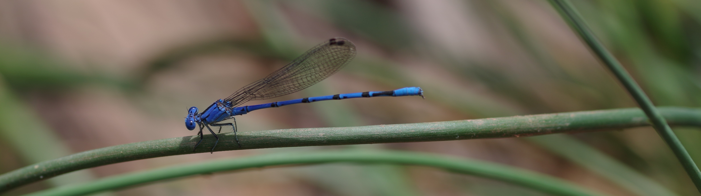

```{r setup}
library(shiny)
library(flexdashboard)
library(fontawesome)
library(leaflet)
library(tidyr)
library(dplyr)
library(ggplot2)
library(sf)
library(kableExtra)
library(scales)
library(DT)
library(httr)
library(jsonlite)

# API Configuration
API_BASE_URL <- "https://postgrest-seamlessgeolmap-734948684426.us-central1.run.app"
API_SCHEMA <- "wetlands"

# Cache environment for storing API responses
api_cache <- new.env()

# Function to fetch data from PostgREST API with fallback to CSV
fetch_data <- function(table_name, csv_filename = NULL) {
  # Check cache first
  cache_key <- paste0("wetdash_", table_name)
  if (exists(cache_key, envir = api_cache)) {
    # Silent caching - no message
    return(get(cache_key, envir = api_cache))
  }
  
  # Try API first
  tryCatch({
    url <- paste0(API_BASE_URL, "/wetdash_", table_name)
    
    response <- GET(
      url,
      add_headers("Accept-Profile" = API_SCHEMA),
      timeout(30)
    )
    
    status <- status_code(response)
    
    if (status == 200) {
      # Silent success - no message
      data <- fromJSON(content(response, "text", encoding = "UTF-8"))
      
      # Convert to data frame if it's a list
      if (is.list(data) && !is.data.frame(data)) {
        data <- as.data.frame(data)
      }
      
      # Store source info for status display
      attr(data, "data_source") <- "API"
      
      # Cache the result
      assign(cache_key, data, envir = api_cache)
      return(data)
    } else if (status == 401) {
      # Silent fallback - no message
      stop("API Unauthorized")
    } else {
      # Silent error - no message
      stop("API request failed with status: ", status)
    }
  }, error = function(e) {
    # Fallback to CSV
    csv_file <- if (is.null(csv_filename)) paste0(table_name, ".csv") else csv_filename
    
    if (file.exists(csv_file)) {
      # Silent fallback - no message
      data <- read.csv(csv_file)
      
      # Store source info for status display
      attr(data, "data_source") <- "CSV"
      
      # Cache the CSV data too
      assign(cache_key, data, envir = api_cache)
      return(data)
    } else {
      stop("Both API and CSV fallback failed for ", table_name, ": ", e$message)
    }
  })
}

# Function to clear cache if needed
clear_cache <- function() {
  rm(list = ls(envir = api_cache), envir = api_cache)
  # Silent cache clear
}

# Load all data using the new fetch function (silently)
site_attr <- fetch_data("site_attr")
flags <- fetch_data("flags")
inverts <- fetch_data("inverts")
invert_taxon <- fetch_data("invert_param")
soil <- fetch_data("soil")
soil_param <- fetch_data("soil_param")
water <- fetch_data("water")
water_param <- fetch_data("water_param")

# Optional: Add a reactive function to refresh data
refresh_data <- function() {
  clear_cache()
  
  # Reload all data
  site_attr <<- fetch_data("site_attr")
  flags <<- fetch_data("flags")
  inverts <<- fetch_data("inverts")
  invert_taxon <<- fetch_data("invert_param")
  soil <<- fetch_data("soil")
  soil_param <<- fetch_data("soil_param")
  water <<- fetch_data("water")
  water_param <<- fetch_data("water_param")
  
  # Silent refresh complete
}

# Commented out original CSV loading for reference
# site_attr <- read.csv('site_attr.csv')
# flags <- read.csv('flags.csv')
# inverts <- read.csv('inverts.csv')
# invert_taxon <- read.csv('invert_param.csv')
# soil <- read.csv('soil.csv')
# soil_param <- read.csv('soil_param.csv')
# water <- read.csv('water.csv')
# water_param <- read.csv('water_param.csv')
```

```{r relabelling code}
huc6_map <- list(
  `Upper Colorado-Dolores` = '140300', 
  `Upper Green` = '140401', 
  `White-Yampa` = '140500',                                    
  `Lower Green` = '140600',   
  `Upper Colorado-Dirty Devil` = '140700', 
  `Lower San Juan` = '140802',  
  `Lower Colorado-Lake Mead` = '150100', 
  `Upper Bear` = '160101',  
  `Lower Bear` = '160102',  
  `Weber` = '160201',  
  `Jordan` = '160202', 
  `Great Salt Lake` = '160203', 
  `Escalante Desert-Sevier Lake` = '160300', 
  `Upper Snake` = '170402' 
)

classify_huc <- function(huc_codes) {
  huc6 <- substr(as.character(huc_codes), 1, 6)
  
  lookup <- unlist(huc6_map)
  names(lookup) <- names(huc6_map)
  huc6_to_label <- setNames(names(lookup), lookup)
  
  sapply(huc6, function(code) {
    if (code %in% names(huc6_to_label)) {
      huc6_to_label[[code]]
    } else {
      "Other"
    }
  })
}

site_attr$Watershed <- classify_huc(site_attr$huc8)

classify_wetland <- function(codes) {
  sapply(codes, function(code) {
    if (grepl("AB", code)) {
      "Aquatic Bed"
    } else if (grepl("EM", code)) {
      "Marsh"
    } else if (grepl("SS", code) || grepl("FO", code)) {
      "Woody"
    } else if (grepl("UB", code) || grepl("US", code)) {
      "Playa/Mudflat"
    } else {
      "Other"
    }
  })
}
site_attr$`Wetland Type` <- classify_wetland(site_attr$sysclass)
```

Background
======================================

Row 
---------------------------------------
###
<h2> **Welcome to the Utah Wetland Data Explorer!** </h2>

Explore water quality, soil chemistry, and macroinvertebrate communities in Utah's wetlands!

Utah is home to [1.5 million acres of wetlands](https://wetlands.geology.utah.gov/). Wetlands have three parts: 1) water at or near the soil surface for some part of the year, 2) hydric soils with low oxygen created by flooding, and 3) hydrophytic plants that have adaptations to flooding and hydric soils. Wetlands are rare in Utah, only three percent of the state, but they provide functions that are crucial to healthy watersheds. Wetland functions include:

 - Improving water quality,
 - Buffering communities from drought and flood,
 - Providing habitat for 80% of Utah's fish and wildlife species, and
 - Providing recreation opportunities for paddling, wildlife watching, hunting, and fishing.
 
Wetland hydrology is dynamic, often switching between deep and shallow flooding or no flooding at all. Dynamic hydrology leads to chemical and biological conditions that set wetlands apart from other aquatic ecosystems like lakes and streams. Decades of research, management, and monitoring in Utah wetlands have produced a trove of chemical, physical, and biological data, but that data is often in disparate reports written by multiple sources.This web application provides data compiled from numerous sources and presents information to the public all in one place.

### 

```{r out.width='100%'}
knitr::include_graphics("bda_strawberry.jpg")
```
```{r eval=FALSE}
#this code works nicely with the css, but it won't scale
<figure>
  
  <figcaption style='text-align: center; margin-top: 5px;'>
    <em>Bolboschoenus maritimus</em> (alkali bulrush) in a marsh in Box Elder County
  </figcaption>
</figure>
```

Row
--------------------------------------

### Water Chemistry Records
```{r background info}
water_sample <- format(length(water$site_param), big.mark = ',')
valueBox(water_sample, icon = 'fa-tint')
```

### Soil Records
```{r}
soil_sample <- format(length(soil$site_param), big.mark = ',')
valueBox(soil_sample, icon = 'fa-earth-americas')
```

### Macroinvertebrate Samples
```{r}
invert_sample <- format(length(unique(inverts$siteid)), big.mark = ',')
valueBox(invert_sample, icon = 'fa-bug')
```

Row 
------------------------------------------
### 

```{r out.width='100%', out.height='80vh'}
knitr::include_graphics("uwam_crew.jpg")
```

```{r, eval=FALSE}
#knitr::include_graphics("uwam_crew.jpg")

works:
  <div style="text-align:center; margin-bottom:20px;">
  
  <div style="background-color:#2a2a2a; color:#fff; font-size:14px; text-align:center; padding:6px 10px; border-radius:0 0 6px 6px; max-width:600px; margin:auto;">
    UGS ecologists monitoring a wetland in Beaver County
  </div>
</div>

{r out.height = "100%", fig.cap = 'UGS ecologists monitoring a wetland in Beaver County'}
```


```{r old fig code, eval=FALSE}

  
  <div class = "image-container">
  
  <div class = "image-caption"> UGS ecologists monitoring a wetland in Beaver County </div>
</div>
  
  <figure>
  
  <figcaption style='text-align: center; margin-top: 5px;'>
    UGS ecologists monitoring a wetland in Beaver County
  </figcaption>
</figure>
```

###
<h3> **Data Sources** </h3>

The bulk of data included here is from samples gathered as part of wetland condition monitoring surveys conducted by the Utah Geological Survey (UGS) and Utah Division of Water Quality. The most common way to measure wetland condition is to assess what types of plants are growing and how much area they cover. Water, soil, and macroinvertebrates provide important clues into factors that drive wetland condition and those samples were gathered alongside plant community monitoring. The existing data is heavily focused around Great Salt Lake, but the UGS hopes to collate more data to paint a full picture of wetland chemistry and biology across Utah. To learn more about data included in this dashboard, check out the resources below:  

 - [The UGS Wetlands Program website](https://geology.utah.gov/water/wetlands/)
 - [The Wetlands collection in the Utah GeoData Archive](https://geodata.geology.utah.gov/pages/collections_featured.php?parent=665)
 - [The Utah Wetland Plant Application](https://wetlandplants.geology.utah.gov/)
 - [The Utah Wetland Mapper](https://wetlands.geology.utah.gov/)

### Data Source Status
```{r data source status}
renderText({
  # Check data sources for each table
  api_tables <- c("site_attr", "flags", "inverts", "invert_param", "soil", "soil_param", "water", "water_param")
  cached_count <- length(ls(envir = api_cache))
  
  if (cached_count > 0) {
    # Check which tables came from API vs CSV
    api_count <- 0
    csv_count <- 0
    
    for (table in api_tables) {
      cache_key <- paste0("wetdash_", table)
      if (exists(cache_key, envir = api_cache)) {
        data_obj <- get(cache_key, envir = api_cache)
        source_type <- attr(data_obj, "data_source")
        if (!is.null(source_type) && source_type == "API") {
          api_count <- api_count + 1
        } else {
          csv_count <- csv_count + 1
        }
      }
    }
    
    if (api_count == cached_count) {
      paste("API Data: All", cached_count, "tables loaded from PostgREST API")
    } else if (csv_count == cached_count) {
      paste("CSV Fallback: All", cached_count, "tables loaded from CSV files")
    } else {
      paste("Mixed Sources:", api_count, "tables from API,", csv_count, "tables from CSV")
    }
  } else {
    "No data loaded"
  }
})

# Optional: Add a refresh button
actionButton("refresh_data", "Refresh Data", class = "btn-sm")

observeEvent(input$refresh_data, {
  tryCatch({
    refresh_data()
    showNotification("Data refreshed successfully!", type = "message")
  }, error = function(e) {
    showNotification(paste("Refresh failed:", e$message), type = "error")
  })
})
```
 
Row
------------------------------------------
###
<h3> **Ways to Explore the Data** </h3>

The tabs at the top of this page will guide you through visualizations and summaries of water chemistry, soil chemistry, and macroinvertebrate communities found in Utah's wetlands. Data from multiple sources are presented in one place and put into a context to help visualize  how the data could be  used in wetland management, restoration, and research.

- **Maps**: Viewing data spatially can show potential regional differences in wetlands or hotspots where a particular parameter is notably different. Maps can highlight gradients of increasing concentration or diversity. A spatial view also allows users to focus on a region, management area, or particular wetland of interest. 
- **Histograms**: These charts show the range of values possible for a measurement as well as what values are most or least common. In histograms, the longest bars show the most common value observed in the data. When a value is less common, the bar will be shorter. 
- **Boxplots**: These plots are a way to compare data across multiple groups. The top and bottom sides of each box mark the 25th and 75th percentiles of observations in that group, whereas the middle bar is the median or middle value. The whiskers on each plot show the maximum and minimum values, and any points above or below those whiskers are considered outliers.
- **Summary statistics**: These values show the details of how a parameter is different between wetland populations of interest for a more exact comparison.  
- **Populations**: The dropdowns at the top of each page allow you to divide data in the plots and tables into different groups. 
  - **Watersheds**: The climate, topography, hydrology, and geology of a watershed determine where wetlands are located and what type of wetlands exist there. The United States is divided into [Hydrologic Unit Codes (HUC's)](https://www.arcgis.com/home/item.html?id=5bbefdcd2511472ea9abd0afedb85c7e), with longer codes (2-12 digits) showing higher resolution of shared water sources. We are showing data in 6-digit Basin codes. 
  - **Ecoregions**: The U.S. is also divided into [ecoregions](https://www.epa.gov/eco-research/ecoregions), which are areas that support similar ecosystems because they have the same landforms, climate, biological communities, and land uses. Utah is very ecologically diverse and supports seven Level III ecoregions, from the arid Colorado Plateau to the high elevation Wasatch and Uinta Mountains.
  - **Wetland Type**: Wetlands can be grouped in several ways, here we are lumping them together by their dominant vegetation type, following the classes developed by [Cowardin](https://www.fws.gov/media/national-wetland-inventory-wetlands-and-deepwater-map-code-diagram) for the U.S. Fish and Wildlife Service. 
- **On Your Own**: A 'Download' button is at the bottom of each tab, where you can download a subset of parameters or all the data. 

Row
------------------------------------------
### 
<h2> **Submit Your Data to the Explorer** </h2>
Please consider submitting your data to the UGS for inclusion in the Wetland Data Explorer. Use the [spreadsheet template provided here](UWDE_submission_template.xlsx) to format your data and submit it to Becka Downard at [beckad@utah.gov](beckad@utah.gov). 

Water Chemistry
==========================================

<h1> **Water Chemistry** </h1>
<!--Banner image -->


Row
-------------------------------------------
###
Wetlands are often called landscape sinks—places low in the landscape where water and the contaminants in the water accumulate. Within a wetland, rising and falling water levels, rapid plant growth, and unique soil microbes concentrate, dilute, transform, or sequester chemicals in the water. In fact, water quality can improve as water flows through wetlands. Water chemistry is a crucial indicator of wetland condition because the plants, fish, and macroinvertebrates in the water are adapted to a specific range of chemistry, and deviations outside of those ranges can be clear markers of human impacts on an ecosystem. We have included water quality criteria for waters that support waterfowl and shorebirds, [Class 3D in Utah](https://adminrules.utah.gov/public/rule/R317-2/Current%20Rules?), where possible, as context. However, Utah Administrative Rules contain a number of caveats and exclusions for applying water quality standards in wetlands.
 
Of the dozens of water chemistry parameters that can be measured, we present the parameters most indicative of wetland condition: general chemistry, nutrients, and metals/metalloids. Parameters not included in the plots below can be downloaded. 

```{r water chem munge}
#goal: combine total and filtered parameters
water$fraction <- rep(NA)
water_fraction <- function(fraction){
  sapply(fraction, function(fraction) {
    if(grepl("_t", fraction)) {
      "total"
    } else if(grepl("_d", fraction)) {
      "filtered"
    }
      else {
        NA
      }
    })
  }
water$fraction <- water_fraction(water$parameter)

```

Row {data-height=200}
-------------------------------------------
###
<div class="dropdown-container">
  <div class="dropdown-item">
  
```{r water category}
selectInput('water_category',  'Water Quality Category', 
            choices = list('General Chemistry' = 'polind', 'Nutrients' = 'nuts','Metal(oids)' = 'toxs'), 
            selected = 'polind')

params_water_measure <- list(
  'polind' = c('do_sat', 'ec25', 'temp', 'ph'), 
  'nuts' = c('cbod', 'nh4_t', 'no3_t', 'po4_t', 'nh4_d', 'no3_d', 'po4_d'), 
  'toxs' = c('hg_t', 'al_t', 'as_t', 'ba_t', 'be_t', 'cd_t', 'cr_t', 'cu_t', 'mn_t', 'ni_t', 'pb_t', 
             'se_t', 'zn_t')
)

uiOutput('h2o_param')
```

</div>
<div class="dropdown-item">

```{r water param}
renderUI({
  req(input$water_category)
  
  choices <- switch(input$water_category, 
                    'polind' = c('Dissolved oxgyen (%)' = 'do_sat', 
                         'Conductivity (us/m)' = 'ec25', 'Temperature (C)' = 'temp', 'pH' = 'ph'), 
                    'nuts' = c('Biological Oxygen Demand' = 'cbod', 'Ammonium (total)' = 'nh4_t', 
                       'Nitrate (total)' = 'no3_t', 'Phosphate (total)' = 'po4_t', 
                       'Ammonium (dissolved)' = 'nh4_d', 'Nitrate (dissolved)' = 'no3_d', 
                       'Phosphate (dissolved)' = 'po4_d'), 
                    'toxs' = c('Mercury' = 'hg_t', 'Aluminum' = 'al_t', 'Arsenic' = 'as_t', 
                               'Barium' = 'ba_t', 'Beryllium' = 'be_t', 'Cadmium' = 'cd_t', 
                               'Chromium' = 'cr_t', 'Copper' = 'cu_t', 'Manganese' = 'mn_t', 
                               'Nickel' = 'ni_t', 'Lead' = 'pb_t', 'Selenium' = 'se_t', 
                               'Zinc' = 'zn_t')
  )
  label <- 'Parameter'
  #option for a label line
  selectInput('h2o_param', label = label, choices = choices)
})
```

</div>
<div class="dropdown-item">

```{r}
selectInput('subpop', 'Grouping', 
            choices = list('Watershed' = 'Watershed', 'Ecoregion' = 'ecoregion', 'Wetland Type' = 'Wetland Type'), 
            selected = 'Watershed')
```

</div>
</div>

Row {data-height=400}
-------------------------------------------
###

```{r}
htmlOutput('category_description')
```

```{r, category text}
output$category_description <- 
  renderUI({
    switch(input$water_category, 
           polind = HTML("
             <p>General Chemistry parameters describe the basic chemistry of a wetland. Changes in these parameters can indicate changes in water quality. Aquatic organisms are adapted to life within specific ranges of conductivity, pH, and temperature.
 </p>
             <ul>
             <li><strong>pH</strong> measures the acidity (pH < 7) or alkalinity (pH > 7) of water. Some pollutants will drive steep changes in pH.</li>
             <li><strong>Conductivity</strong> is a measure of how salty water is. Water with more salts will have higher measures of conductivity. Utah wetlands vary significantly in conductivity, from freshwater alpine ponds to hypersaline Great Salt Lake playas. </li>
             <li><strong>Dissolved oxygen</strong> is the amount of oxygen available for aquatic animals to breathe. Decomposition of plants and algae associated with excessive nutrient concentration lowers dissolved oxygen in water.</li>
             <li><strong>Temperature</strong> determines which organisms can survive in wetlands because temperature regulates metabolic processes. Temperature also influences water chemistry, especially how much dissolved gases water can hold.</li>
             </ul>
             "), 
           nuts = HTML("
           <p>Nutrients are the compounds plants need to grow and are cycled through the environment between water, soils, plants, and animals. Wetlands are nutrient cycling hotspots because of the chemical reactions that happen where oxygenated water and soils meet anoxic zones. Though they are necessary for life, too much nitrogen, phosphorus, or carbon, including the elements in excess fertilizer runoff, can throw off the balance of an ecosystem, favoring rapidly growing plants and animals.</p>
           <ul>
           <li><strong>Nitrogen</strong> is necessary for making proteins and conducting photosynthesis, and is the element that most often limits plant growth and productivity. Fertilizers boost nitrogen in soils, but excess fertilizer runs off into waterways and can become pollution. Two forms of nitrogen are measured in wetlands: nitrate, which is more common in well-oxygenated water, and ammonia, which is more common in anoxic waters.</li>
           <li><strong>Phosphorus</strong> is required for metabolism and reproduction in plants, and it is a common component of fertilizers as well as human waste. Just like nitrogen, excess phosphorus negatively impacts ecosystem health. Phosphate (PO<sub>4</sub>) is the most commonly measured form of phosphorus.</li>
           <li><strong>Carbon</strong> is the basis for all organic material and is found in innumerable chemical forms. We measure organic material in wetlands as dissolved/total organic carbon as well as biological oxygen demand. The first is a measure of how much organic matter is in the water, and the second is a measure of how much microbial energy is needed to decompose that matter.</li>
          <ul>
          <li><em>*Nutrients are measured both as total concentration and dissolved or filtered fractions. We include both together in the plots below, designated by different markers.<em></li>
          </ul>
          </li>
           </ul>
           "), 
           toxs = HTML("Metals and Metalloids are elements that are naturally found in the Earth's crust and waterways. Human activities like irrigation, manufacturing, and driving vehicles concentrate those elements in waterways. Some metals and metalloids are toxic to wildlife and humans, leading to death and deformities. Others accumulate in animal fats and cause birth defects or death at higher trophic levels. Many elements are critical micronutrients for plants and animals, and only become impactful at high concentrations.</p>
           <ul>
           <li><strong>Arsenic</strong>, <strong>cadmium</strong>, <strong>chromium</strong>, <strong>lead</strong>, and <strong>mercury</strong>  are toxic even at very low concentrations. These elements are highest in waters influenced by industrial discharges and mining. Mercury is of special concern because it bioaccumulates in the food chain.</li>
           <li><strong>Copper</strong>, <strong>nickel</strong>, <strong>selenium</strong>, and <strong>zinc</strong> are used in small amounts by plants and animals. However, high concentrations from improper fertilizer use, industrial pollution, or mining can cause toxicity.</li>
           <li><strong>Aluminum</strong>, <strong>barium</strong>, and <strong>iron</strong>  are all very common in the Earth's crust and usually harmless in the water, but are indicators of geologic processes such as interactions with groundwater or acid mine drainage. At low pH, these elements become more toxic.</li>
           </ul>
           ")
    )
  })
```


Row 
--------------------------------------------
### Spatial Patterns
```{r, water map}
water <- left_join(water, site_attr %>% select(siteid, latitude, longitude, ecoregion, Watershed, `Wetland Type`)) %>% 
  filter(!is.na(longitude) & !is.na(latitude)) %>% 
    st_as_sf(coords = c('longitude', 'latitude')) %>% 
    st_set_crs(4326)

filtered <- reactive({
  req(input$h2o_param)
  water %>% 
    filter(parameter == input$h2o_param)
  })

renderLeaflet({
  data <- filtered()
  req(nrow(data) > 0)
  data <- left_join(data, water_param %>% select(parameter, units), by = 'parameter')

  pal <- colorNumeric(palette = 'plasma', domain = data$value, reverse = TRUE)
  chart_info <- subset(water_param, parameter == unique(data$parameter))
  chart_title <- paste0(chart_info$definition[1], ' (', chart_info$units[1], ')')

  leaflet(data = data) %>% 
    addProviderTiles(providers$CartoDB.Positron) %>% 
    addCircleMarkers(color = ~pal(value), 
                       fillOpacity = 1,  stroke = 1, 
                     label = ~paste0(value, ' ', units)) %>% 
                     #label = ~as.character(value)) %>% 
                     #label = paste0(~(value), ' (', chart_info$units, ')')) %>% 
      addLegend(pal = pal, values = data$value, 
                position = 'bottomright', opacity = 1, 
                title = chart_title)
})

```

Row
---------------------------------------------
### Parameter Distribution
```{r}
subpop <- reactive({
  req(input$subpop)
  
  filtered() %>% 
    mutate(subpop = .data[[input$subpop]]) %>% 
    select(siteid, parameter, value, subpop)
  })

renderPlot({ 
  req(subpop())
  data_hist <- subpop()
  chart_info <- subset(water_param, parameter == unique(data_hist$parameter))
  chart_title <- paste0(chart_info$definition[1], ' ', chart_info$units[1])
  
  ggplot(data_hist, aes(x = value, fill = subpop)) + 
      geom_histogram(bins = 10, color = 'gray20') + 
    scale_fill_brewer(palette = 'PuOr', name = input$subpop) + 
    guides(fill = 'none') + 
      scale_x_continuous(label = scales::comma) + 
      labs(x = chart_title,
           y = 'Frequency') + 
    coord_flip() + 
      theme_minimal()
    })
```

### Group Comparison
```{r}
renderPlot({
  req(subpop())
  data_box <- subpop()
  chart_info <- subset(water_param, parameter == unique(data_box$parameter))
  chart_title <- paste0(chart_info$definition[1], ' ', chart_info$units[1])
    ggplot(data_box, aes(x = subpop, y = value, fill = subpop)) + 
      geom_boxplot(alpha = 0.9) + geom_jitter(width = 0.1, alpha = 0.8, color = '#5E5E5E') + 
      scale_fill_brewer(palette = 'PuOr', name = NULL) + 
      guides(fill = 'none') +
      labs(x = NULL, y = chart_title) + 
      scale_x_discrete(labels = function(x){sub('\\s', '\n', x)}) + 
      scale_y_continuous(label = comma) + 
      theme_minimal()
  })
```

Row {data-height=400}
--------------------------------------------
### Summary

```{r}
renderDataTable({ 
  table_df <- subpop() %>% 
    st_drop_geometry() %>% 
    group_by(subpop) %>% 
      summarise(
        `Sample Size` = n(), 
        Minimum = min(value, na.rm = TRUE), 
        Median = median(value, na.rm = TRUE),
        Mean = mean(value, na.rm = TRUE), 
        Maximum = max(value, na.rm = TRUE), 
        .groups = 'drop'
      ) %>% 
    mutate(across(where(is.numeric), ~signif(., 2))) %>% 
    rename(Group = subpop) %>% 
    select(Group, `Sample Size`, Minimum, Median, Mean, Maximum)
  
  datatable(table_df,
    rownames = FALSE,
    class = 'compact dark-theme', 
    options = list(
      dom = 'ft', 
      ordering = FALSE, 
      autoWidth = TRUE, 
      columnDefs = list(list(className = 'dt-center', targets = '_all'))
    ))
})
```

### Download Water Data
```{r new download}
# Conditionally remove X column if it exists
water_clean <- if("X" %in% names(water)) select(water, -X) else water
water_param_clean <- if("X" %in% names(water_param)) select(water_param, -X) else water_param
for_download <- left_join(water_clean, water_param_clean, by = 'parameter')

div(class = "download-box",
    
    #tags$h4("Download Water Data"),
    
    tags$p("Download water quality data in a convenient format for your own analysis, research, or reporting. Choose a category below."),
    
    fluidRow(
      column(6,
             selectInput(
               inputId = 'water_download',
               label = 'Select Group',
               choices = list(
                 'Pollution Indicators' = 'polind',
                 'Nutrients' = 'nuts',
                 'Toxics' = 'toxic',
                 'General Chemistry' = 'genchem'
               ),
               multiple = TRUE
             )
      ),
      column(6,
             downloadButton('download_data', label = 'Download', class = "btn-download")
      )
    )
)

# Filter data reactively
filtered_water_data <- reactive({
  req(input$water_download)
  for_download %>%
    filter(category %in% input$water_download)
})

# Create download
output$download_data <- downloadHandler(
  filename = function() {
    paste0('wetland_waterchem_', Sys.Date(), '.csv')
  },
  content = function(file) {
    write.csv(filtered_water_data(), file, row.names = FALSE)
  }
)
```


Soil Chemistry
========================================
<h1> **Soil Chemistry** </h1>
<!--Banner image -->


Row
----------------------------------------------
###
Soil is where plants are rooted, where the nutrients they need are stored, and where many of the biogeochemical processes that wetlands perform occur. Wetland soils are different from "upland" soils because flooding depletes oxygen in the soil. In the absence of oxygen, soil microbes transform nitrogen, manganese, sulfur, and compounds to metabolize. Water moves slowly through wetlands, which allows chemicals in the water column to settle out and bind to soils. The accumulation and transformation of chemicals in the soil give a more integrated picture of wetland chemistry than water. Soils are also a more reliable measure of the wetland environment because they are always present, whereas water is not. 

Two types of soil measures are displayed below: general chemistry measures and nutrients that are the results of individual soil analyses and elemental scan results produced by mass spectrometry analysis. 

Row {data-height=200}
-------------------------------------------
<div class="dropdown-container">
  <div class="dropdown-item">
  
```{r soil category}
soil <- soil %>% 
  mutate(category = case_when(
    parameter %in% c("nh4n_s", "no3n_s", "nh4n_e", "no3n_e", "po4p_s", "orgmat_s", 'ec_s', 'ph_s') ~ 'gennuts', 
    parameter %in% c("ba_s", "al_s", "as_s", "b_s", "ca_s", "cd_s", "co_s", "cr_s", "cu_s", "fe_s", 
                     "k_s", "pb_s", "mg_s", "mn_s", "mo_s", "na_s", "ni_s", "p_s", "s_s", "se_s", 
                     "sr_s", "zn_s", "hg_s") ~ 'ipms')
    )

selectInput('soil_category',  'Soil Chemistry Category', 
            choices = list('General and Nutrients' = 'gennuts', 'Element Scan' = 'ipms'), 
            selected = 'gennuts')

uiOutput('soil_param')
```

</div>
<div class="dropdown-item">

```{r soil parameter}
renderUI({
  req(input$soil_category)
  
  choices <- switch(input$soil_category, 
                    'gennuts' = c('Ammonium' = "nh4n_s", 'Nitrate' = "no3n_s", 'Ammonium (KCl)' = "nh4n_e", 
                                  'Nitrate (KCl)' = "no3n_e", 'Phosphate' = "po4p_s", 
                                  'Organic Matter' = "orgmat_s", 'Conductivity' = 'ec_s', 'pH' = 'ph_s'), 
                    'ipms' = c('Barium' = "ba_s", 'Aluminum' = "al_s", 'Arsenic' = "as_s", 'Boron' = "b_s", 
                               'Calcium' = "ca_s", 'Cadmium' = "cd_s", 'Cobalt' = "co_s", 'Chromium' = "cr_s", 
                               'Copper' = "cu_s", 'Iron' = "fe_s", 'Potassium' = "k_s", 'Lead' = "pb_s", 
                               'Magnesium' = "mg_s", 'Manganese' = "mn_s", 'Molybdenum' = "mo_s", 'Sodium' = "na_s", 
                               'Nickel' = "ni_s", 'Phosphorus' = "p_s", 'Sulfur' = "s_s", 'Selenium' = "se_s",
                               'Strontium' = "sr_s", 'Zinc' = "zn_s", 'Mercury' = "hg_s")
  )
  label <- 'Parameter'
  #option for a label line
  selectInput('soil_param', label = label, choices = choices)
})
```

</div>
<div class="dropdown-item">

```{r soil subpop}
selectInput('subpop_soil', 'Subpopulation', 
            choices = list('Watershed' = 'Watershed', 'Ecoregion' = 'ecoregion', 'Wetland Type' = 'Wetland Type'), 
            selected = 'Watershed')
```

</div>
</div>

Row {data-height=350}
-------------------------------------------
###

```{r}
htmlOutput('category_desc_soil')
```

```{r}
output$category_desc_soil <- 
  renderUI({
    switch(input$soil_category, 
           gennuts = HTML("
             <p>General chemistry parameters are the key drivers of which organisms can survive in wetlands, based on tolerance to salinity, alkalinity, and organic matter. Nutrients are the compounds plants need to grow, including elements in fertilizers, and are most accessible to plants in soils. </p>
             <ul>
             <li><strong>pH</strong>measures the acidity (pH < 7) or alkalinity (pH > 7) of soil. Many Utah soils are alkaline due to the prevalence of carbonate rock.</li>
             <li><strong>Conductivity</strong> is a measure of soil salinity. Saline soils are challenging for plants to grow in because they affect the plant's water balance. Many wetland plants have adaptations to survive salty soils.</li>
             <li><strong>Organic matter</strong> is the portion of soil composed of material from organisms in various stages of decomposition. Organic matter builds up in wetland soils because decomposition is slower than in uplands. Soil organic matter provides crucial nutrients for plants and is a form of carbon storage.</li>
             <li><strong>Nitrogen</strong> in soils is more easily accessed by plant roots than nitrogen in water, but is needed for the same cell processes. Nitrate and ammonia forms of nitrogen are both found in wetland soils, but ammonia concentration is often higher because nitrates are converted to other forms in oxygen-depleted conditions.</li>
           <li><strong>Phosphorus</strong> accumulates in wetland soils because it readily binds to sediments. Plants are able to easily access phosphorus in soil for their metabolic needs, but much of it remains bound to soils and is a good indicator of legacy nutrient enrichment.</li>
           </ul>
           "), 
           ipms = HTML("
           <p>Soils reflect the elemental geology of a region, which can be determined using mass spectrometry to measure elemental concentrations in the soil. . The elements that accumulate in soils also reflect longer-term patterns of chemistry as contaminants are bound to and buried in soils.</p>
           <ul>
           <li><strong>Arsenic</strong>, <strong>cadmium</strong>, <strong>copper</strong>, <strong>nickel</strong>, <strong>lead</strong>, <strong>mercury</strong>, <strong>selenium</strong>, and <strong>zinc</strong> are metals and metalloids that indicate a history of contamination from industrial and residential sources. Arsenic and selenium are particularly concerning because they are toxic to wildlife that feed in wetlands.</li>
           <li><strong>Potassium</strong>, <strong>calcium</strong>, <strong>magnesium</strong>, and <strong>sulfur</strong> are important plant macronutrients.</li> 
           <li><strong>Boron</strong>, <strong>copper</strong>, <strong>iron</strong>, <strong>manganese</strong>, <strong>molybdenum</strong>, <strong>nickel</strong>, and <strong>zinc</strong> are critical micronutrients for plants.</li>
           </ul>
           ")
    )
  })
```

Row
---------------------------------------
### Spatial Patterns

```{r soil map}
soil <- left_join(soil, site_attr %>% select(siteid, latitude, longitude, ecoregion, Watershed, `Wetland Type`), by = 'siteid') %>% 
  filter(!is.na(longitude) & !is.na(latitude)) %>% 
    st_as_sf(coords = c('longitude', 'latitude'), crs = 4326) 

filtered_soil <- reactive({
  req(input$soil_param)
  soil %>% 
    filter(parameter == input$soil_param)
  })

renderLeaflet({
  data_soil <- filtered_soil()
  req(nrow(data_soil) > 0)

  pal <- colorNumeric(palette = 'plasma', domain = data_soil$value, reverse = TRUE)
  chart_info_soil <- subset(soil_param, parameter == unique(data_soil$parameter))
  chart_title_soil <- paste0(chart_info_soil$definition[1], ' (', chart_info_soil$units[1], ')')

  leaflet(data = data_soil) %>% 
    addProviderTiles(providers$CartoDB.Positron) %>% 
    addCircleMarkers(color = ~pal(value), 
                       fillOpacity = 1,  stroke = TRUE, 
                     label = ~as.character(value)) %>% 
      addLegend(pal = pal, values = data_soil$value, 
                position = 'bottomright', opacity = 1, 
                title = chart_title_soil)
})
```

Row
----------------------------------------
### Parameter Distribution
```{r, soil histogram}
subpop_soil <- reactive({
  req(input$subpop_soil)
  
  filtered_soil() %>% 
    mutate(subpop = .data[[input$subpop_soil]]) %>% 
    select(siteid, parameter, value, subpop)
  })

renderPlot({ 
  req(subpop_soil())
  data_hist_soil <- subpop_soil()
  chart_info_soil <- subset(soil_param, parameter == unique(data_hist_soil$parameter))
  chart_title_soil <- paste0(chart_info_soil$definition[1], ' ', chart_info_soil$units[1])
  
  ggplot(data_hist_soil, aes(x = value, fill = subpop)) + 
      geom_histogram(bins = 10, color = 'gray20') + 
      scale_fill_brewer(palette = 'PuOr', 
                           name = NULL) + 
    guides(fill = 'none') + 
      scale_x_continuous(label = scales::comma) + 
      labs(x = chart_title_soil,
           y = 'Frequency') + 
    coord_flip() + 
      theme_minimal()
    })
```


### Group Comparison
```{r, soil boxplot}
renderPlot({
  req(subpop_soil())
  data_box_soil <- subpop_soil()
  chart_info_soil <- subset(soil_param, parameter == unique(data_box_soil$parameter))
  chart_title_soil <- paste0(chart_info_soil$definition[1], ' ', chart_info_soil$units[1])
    ggplot(data_box_soil, aes(x = subpop, y = value, fill = subpop)) + 
      geom_boxplot(alpha = 0.9) + geom_jitter(width = 0.1, alpha = 0.8) + 
      scale_fill_brewer(palette = 'PuOr') + 
      guides(fill = 'none') +
      labs(x = '', y = chart_title_soil) + 
      scale_x_discrete(labels = function(x){sub('\\s', '\n', x)}) + 
      scale_y_continuous(label = comma) + 
      theme_minimal()
  })
```

Row {data-height=400}
---------------------------------------
### Summary 

```{r, soil table}
renderDataTable({ 
  table_df_soil <- subpop_soil() %>% 
    st_drop_geometry() %>% 
    group_by(subpop) %>% 
      summarise(
        `Sample Size` = n(), 
        Minimum = min(value, na.rm = TRUE), 
        Median = median(value, na.rm = TRUE), 
        Mean = mean(value, na.rm = TRUE), 
        Maximum = max(value, na.rm = TRUE), 
        .groups = 'drop'
      ) %>% 
    mutate(across(where(is.numeric), ~signif(., 2))) %>% 
    rename(Group = subpop) %>% 
    select(Group, `Sample Size`, Minimum, Median, Mean, Maximum)
  
  datatable(table_df_soil,
    rownames = FALSE, 
    class = 'compact dark-theme', 
    options = list(
      dom = 'ft', 
      ordering = FALSE, 
      autowidth = TRUE, 
      columnDefs = list(list(className = 'dt-center', targets = '_all'))
    ))
})
```


### Download Soil Data

```{r, download soil}
# Conditionally remove X column if it exists
soil_clean <- if("X" %in% names(soil)) select(soil, -X) else soil
soil_param_clean <- if("X" %in% names(soil_param)) select(soil_param, -X) else soil_param
for_download_soil <- left_join(soil_clean, soil_param_clean, by = 'parameter')

div(class = "download-box",
    
    tags$p("Download soil data in a convenient format for your own analysis, research, or reporting. Choose a category below."),
    
    fluidRow(
      column(6,
             selectInput(
               inputId = 'soil_download',
               label = 'Select a group to download',
               choices = list('General and Nutrients' = 'gennuts', 'Element Scan' = 'ipms'), 
            multiple = TRUE
             )
      ),
      column(6,
             downloadButton('download_soil', label = 'Download', class = "btn-download")
      )
    )
)

# Filter data reactively
filtered_soil_data <- reactive({
  req(input$soil_download)
  for_download_soil %>%
    filter(category %in% input$soil_download)
})

# Create download
output$download_soil <- downloadHandler(
  filename = function() {
    paste0('wetland_soilchem_', Sys.Date(), '.csv')
  },
  content = function(file) {
    write.csv(filtered_soil_data(), file, row.names = FALSE)
  }
)
```

Wetland Macroinvertebrates
=======================================
<h1> **Macroinvertebrates** </h1>
<!--Banner image -->


Row
---------------------------------------
###
Macroinvertebrates are organisms without internal skeletons that are larger than 0.5 mm. Common types of macroinvertebrates found in Utah wetlands include larval insects (midges, flies, dragonflies, etc.), worms, snails, and crayfish. Macroinvertebrates form crucial links in the wetland foodweb, feeding on plants and decomposing material and in turn being eaten by birds, amphibians, and fish. The community data presented here are benthic macroinvertebrates: the community of invertebrates that live in the water. Flying macroinvertebrates and those living on the plants are also important, but much harder to accurately count. The size, diversity, and makeup of benthic macroinvertebrates are indicators of ecosystem health and water quality, though research is still needed to determine which species are the most reliable signals of healthy wetlands.

 - **Abundance** is the total number of macroinvertebrates of any group found in a sample gathered by sweeping a net at the soil/water interface.
 - **Taxa Richness** is a count of all the different types of organisms in a sample. An organism can be identified at many levels, depending on the life stage of the invertebrate and the skill of the laboratory. Species is the most detailed taxonomic level, but especially small and cryptic invertebrates may only be identified to Order (e.g., mites are in the order Trombidiformes). From largest to smallest, taxonomic levels are Kingdom > Phylum > Class > Order > Family > Genus > Species.
 - **ETO Relative Richness** is the proportion of the total measure of abundance that is composed of three orders of insects: Ephemeroptera (mayflies), Tricoptera (caddisflies), and Odonata (dragonflies and damselflies). These orders are especially sensitive to disturbances like changes in water quality. Samples with a majority of ETO taxa are indicators of lower disturbance and healthier wetlands.

```{r invert data munge}
inverts <- inverts %>% 
  filter(!site_taxa %in% flags$site_param) #remove vertebrates from sample

invert_metrics <- inverts %>% group_by(siteid) %>% 
  summarise(
    richness = n(), 
    abundance = sum(abundance), 
    .groups = 'drop' #what does this piece do?
  )

eto_taxa <- invert_taxon %>% 
  filter(order %in% c('Ephemeroptera', 'Tricoptera', 'Odonata'))
  
eto_data <- inverts %>% 
  filter(taxon %in% eto_taxa$taxon) %>% 
  group_by(siteid) %>% 
  summarise(
    eto_raw = sum(abundance), .groups = 'drop'
  )

invert_metrics <- invert_metrics %>% 
  left_join(eto_data, by = 'siteid') %>% 
  mutate(
    eto_raw = replace_na(eto_raw, 0), 
    eto_rel = eto_raw / abundance
  )

invert_metrics_long <- invert_metrics %>% 
  select(-eto_raw) %>% 
  pivot_longer(
    cols = -siteid, 
    names_to = 'parameter', 
    values_to = 'value'
)

#relative abundance by feeding group, bug type, and arthropod order
feed_group <- inverts %>% 
  left_join(invert_taxon %>% select(taxon, feed_group), by = 'taxon') %>% 
  group_by(siteid, feed_group) %>% 
  summarise(
    abund = sum(abundance), .groups = 'drop') %>% 
  pivot_wider(names_from = feed_group, values_from = abund, values_fill = 0) %>% 
  left_join(select(invert_metrics, siteid, abundance), by = 'siteid') %>% 
  mutate(across(-c(siteid, abundance), ~ .x / abundance)) %>% #this is important for shortening
  select(-abundance) %>% 
  pivot_longer(
    cols = -siteid, 
    names_to = 'group', 
    values_to = 'rel_abnd') %>% 
  mutate(parameter = 'feed_grp')

group_taxa <- select(invert_taxon, taxon, group)

bug_type <- inverts %>% 
  left_join(group_taxa, by = 'taxon') %>% 
  group_by(siteid, group) %>% 
  summarise(
    abund = sum(abundance), .groups = 'drop') %>% 
  pivot_wider(names_from = group, values_from = abund, values_fill = 0) %>% 
  left_join(select(invert_metrics, siteid, abundance), by = 'siteid') %>% 
  mutate(across(-c(siteid, abundance), ~ .x / abundance)) %>% 
  select(-abundance) %>% 
  pivot_longer(
    cols = -siteid, 
    names_to = 'group', 
    values_to = 'rel_abnd') %>% 
  mutate(parameter = 'bug_type') #when to use mutate function
 
group_map <- list(
  Snails = c('snail', 'spring_snail', 'mud_snail'), 
  Beetles = c('aquat_beetle', 'leaf_beetle', 'diving_beetle', 'riffle_beetle'), 
  Midges = c('biting_midge', 'midge'), 
  Flies = c('fly', 'cranefly'), 
  Mayflies = ('mayfly'), 
  Waterbugs = c('waterbug', 'boatmen', 'backswimmer'), 
  Amphi_Isopods = c('amphipod', 'isopod'), 
  Worms = c('leech', 'worm', 'tuficid_worm', 'flatworm'), 
  Damsel_Dragonflies = c('damselfly', 'dragonfly'),
  Mites = ('mite'),
  Other = c('caterpillar', 'dobsonfly', 'mosquito', 'springtail', 'caddisfly', 'mussel', 'nematod', 'pea_clam')
)
reverse_map <- unlist(lapply(names(group_map), function(k) setNames(rep(k, length(group_map[[k]])), group_map[[k]])))

bug_type <- bug_type %>% 
  mutate(group = recode(group, !!!reverse_map))

arthro_orders <- invert_taxon %>%
  filter(phylum == "Arthropoda") %>%
  select(taxon, order)

arthro_data <- inverts %>%
  filter(taxon %in% arthro_orders$taxon) %>%
  left_join(arthro_orders, by = "taxon") %>%
  group_by(siteid, order) %>%
  summarise(abund = sum(abundance), .groups = 'drop') %>%
  pivot_wider(names_from = order, values_from = abund, values_fill = 0) %>%
  left_join(select(invert_metrics, siteid, abundance), by = "siteid") %>%
  mutate(across(-c(siteid, abundance), ~ .x / abundance)) %>%
  select(-abundance) %>%
  pivot_longer(
    cols = -siteid,
    names_to = "group",
    values_to = "rel_abnd"
  ) %>%
  mutate(parameter = "arthropod")
#still need to limit the number of groups
#   summarise(
#     Amphipoda = Amphipoda/abundance, 
#     Coleoptera = Coleoptera/abundance, 
#     Diptera = Diptera/abundance, 
#     Ephemeroptera = Ephemeroptera/abundance, 
#     Hemiptera = Hemiptera/abundance, 
#     Isopoda = Isopoda/abundance, 
#     Odonata = Odonata/abundance, 
#     Trichoptera = Trichoptera/abundance, 
#     Trombidiformes = Trombidiformes/abundance
#   )

comm_data <- bind_rows(feed_group, bug_type, arthro_data)

```

Row {data-height=100}
-------------------------------------------
<div class="dropdown-container">
  <div class="dropdown-item">

```{r invert data pickers}
selectInput('invert_param',  'Macroinvertebrate Metrics', 
            choices = list('Abundance' = 'abundance', 'Taxa Richness' = 'richness', 
                           'ETO Relative Richness' = 'eto_rel'), 
            selected = 'abundance')
```

</div>
<div class="dropdown-item">

```{r}
selectInput('subpop_invert', 'Subpopulation', 
            choices = list('Watershed' = 'Watershed', 'Ecoregion' = 'ecoregion', 'Wetland Type' = 'Wetland Type'), 
            selected = 'Watershed')
```

</div>
</div>


Row {data-height=100}
--------------------------------------------
###

```{r}
htmlOutput('invert_desc')
```

```{r}
output$invert_desc <- 
  renderUI({
    switch(input$invert_param, 
           abundance = HTML("
             <p><strong>Abundance</strong> is a the total number of macroinvertebrates of any group found in a sample, in this case, 1-m sweeps of the soil/water interface. Healthy wetlands have macroinvertebrate communities that are both abundant and diverse. 
           </p>"), 
           richness = HTML("
           <p><strong>Taxa Richness</strong> is a count of all the different types of organisms in a sample. An organism can be identified at many levels, depending on the life stage of the invertebrate and the skill of the laboratory. Species is the most detailed taxanomic level, but especially small and cryptic invertebrates may only be identified to Order (ex. mites are in the order Trombidiformes). From largest to smallest, taxonmic levels are Kingdom > Phyllum > Class > Order > Family > Genus > Species.
           </p>"), 
           eto_rel = HTML("
           <p><strong>ETO Relative Richness</strong> is the proportion of the total measure of abundance that is composed of three orders of insects: Ephemeroptera (mayflies), Tricoptera (caddisflies), and Odonata (dragon- and damselflies). These orders are especially sensitive to disturbances like changes in water quality. Samples with a majority of ETO taxa are indicators of low disturbance and heathier wetlands.
           </p>")
    )
  })
#ug. EPT (ephemeroptera, plecoptera, and trichoptera)
#(O should be Plecoptera or stoneflies
```

Row
---------------------------------------
### Spatial Patterns

```{r, invert map}
invert_metrics_long <- left_join(invert_metrics_long, site_attr %>% select(siteid, latitude, longitude, ecoregion, Watershed, `Wetland Type`), by = 'siteid') %>% 
  filter(!is.na(longitude) & !is.na(latitude)) %>% 
    st_as_sf(coords = c('longitude', 'latitude'), crs = 4326) 

invert_param <- data.frame(
  parameter = c('abundance', 'richness', 'eto_rel'),
  definition = c('Macroinvertebrate Abundance', 'Taxon Richness', 'ETO Relative Richness'), 
  units = c('Individual Count', 'Taxa Count', 'ETO % of Total Sample')
)
filtered_invert <- reactive({
  req(input$invert_param)
  invert_metrics_long %>% 
    filter(parameter == input$invert_param)
  })

renderLeaflet({
  data_invert <- filtered_invert()
  req(nrow(data_invert) > 0)

  pal <- colorNumeric(palette = 'plasma', domain = data_invert$value, reverse = TRUE)
  chart_info_invert <- subset(invert_param, parameter == unique(data_invert$parameter))
  chart_title_invert <- paste0(chart_info_invert$definition[1], ' (', chart_info_invert$units[1], ')')

  leaflet(data = data_invert) %>% 
    addProviderTiles(providers$CartoDB.Positron) %>% 
    addCircleMarkers(color = ~pal(value), 
                       fillOpacity = 1,  stroke = TRUE, 
                     label = ~as.character(value)) %>% 
      addLegend(pal = pal, values = data_invert$value, 
                position = 'bottomright', opacity = 1, 
                title = chart_title_invert)
})
```

Row
---------------------------------------
### Parameter Distribution

```{r, invert histogram}
subpop_invert <- reactive({
  req(input$subpop_invert)
  
  filtered_invert() %>% 
    mutate(subpop = .data[[input$subpop_invert]]) %>% 
    select(siteid, parameter, value, subpop)
  })

renderPlot({ 
  req(subpop_invert())
  data_hist_invert <- subpop_invert()
  chart_info_invert <- subset(invert_param, parameter == unique(data_hist_invert$parameter))
  chart_title_invert <- paste0(chart_info_invert$definition[1], ' ', chart_info_invert$units[1])
  
  ggplot(data_hist_invert, aes(x = value, fill = subpop)) + 
      geom_histogram(bins = 10, color = 'gray20') + 
      scale_fill_brewer(palette = 'PuOr', 
                           name = NULL) + 
    guides(fill = 'none') + 
      scale_x_continuous(label = scales::comma) + 
      labs(x = chart_title_invert,
           y = 'Frequency') + 
    coord_flip() + 
      theme_minimal()
    })
```

### Group Comparison

```{r, invert boxplot}
renderPlot({
  req(subpop_invert())
  data_invert <- subpop_invert()
  chart_info_invert <- subset(invert_param, parameter == unique(data_invert$parameter))
  chart_title_invert <- paste0(chart_info_invert$definition[1], ' ', chart_info_invert$units[1])
    ggplot(data_invert, aes(x = subpop, y = value, fill = subpop)) + 
      geom_boxplot(alpha = 0.9) + geom_jitter(width = 0.1, alpha = 0.8) + 
      scale_fill_brewer(palette = 'PuOr', name = NULL) + 
      guides(fill = 'none') +
      labs(x = '', y = chart_title_invert) + 
      scale_x_discrete(labels = function(x){sub('\\s', '\n', x)}) + 
      scale_y_continuous(label = comma) + 
      theme_minimal()
  })
```

Row {data-height=400}
---------------------------------------
### Summary

```{r, invert table}
renderDataTable({ 
  table_df_invert <- subpop_invert() %>% 
    st_drop_geometry() %>% 
    group_by(subpop) %>% 
      summarise(
        `Sample Size` = n(), 
        Minimum = min(value, na.rm = TRUE), 
        Median = median(value, na.rm = TRUE), 
        Mean = mean(value, na.rm = TRUE), 
        Maximum = max(value, na.rm = TRUE), 
        .groups = 'drop'
      ) %>%
    mutate(across(where(is.numeric), ~signif(., 2))) %>% 
    rename(Group = subpop) %>% 
    select(Group, `Sample Size`, Minimum, Median, Mean, Maximum)
 
  datatable(table_df_invert,
            rownames = FALSE,
            class = 'compact dark-theme', 
            options = list(
              dom = 'ft', 
              ordering = FALSE, 
              autowidth = TRUE, 
              columnDefs = list(list(className = 'dt-center', targets = '_all'))
            ))
})
```

### Download Macroinvertebrate Data

```{r, invert download}
for_download_invert <- pivot_wider(
  inverts, 
  id_cols = siteid, 
  names_from = taxon, 
  values_from = abundance, 
  values_fill = NA
)

for_download_invert <- left_join(for_download_invert, site_attr %>% select(siteid, date, latitude, longitude))

div(class = "download-box",
    
    tags$p("Download macroinvertebrate data in a convenient format for your own analysis, research, or reporting."),
    
    fluidRow(
      column(12,
             downloadButton('download_invert', label = 'Download', class = "btn-download")
      )
    )
)

output$download_invert <- downloadHandler(
  filename = function(){
    paste0('wetland_inverts', Sys.Date(), '.csv')
  }, 
  content = function(file) {
    write.csv(for_download_invert(), file, row.names = FALSE)
  }
)
```

Row 
------------------------------------------
### Macroinvertebrate Community Plots

The relative abundance of macroinvertebrate community components can provide even more detail on wetland functions. Use the dropdown below to explore the relative abundance of feeding groups, types of macroinvertebrates, and types of arthropods. 

 - Diversity in macroinvertebrate communities is reflected in diverse feeding groups. Some collect food by filtering water or gathering from surfaces. Snails and others scrape algae from soils and plants. Some macroinvertebrates eat plants by shredding or piercing them. Still others are predators, consuming smaller macroinvertebrates. 
 - Exploring the types of macroinvertebrates shows more of the differences between the types of wetlands. Some wetland types may be better habitat for the larvae of flying insects that will later hatch, while others support beetles and isopods that live their whole lives in water. 
 - **Arthropods** -- the class of macroinvertebrates with hard exoskeletons -- are among the most diverse animal groups in the world and wetland arthropod communities are no exception. 


Row {data-height=100}
-------------------------------------------
<div class="dropdown-container">
  <div class="dropdown-item">
  
```{r, comm dropdown}
selectInput('invert_comm',  'Community Metrics', 
            choices = list('Feeding Group' = 'feed_grp', 'Bug Type' = 'bug_type', 'Arthropod Order' = 'arthropod'), 
                          selected = 'feed_grp')
```

</div>
<div class="dropdown-item">

```{r}
selectInput('subpop_comm', 'Subpopulation', 
            choices = list('Watershed' = 'Watershed', 'Ecoregion' = 'ecoregion', 'Wetland Type' = 'Wetland Type'), 
            selected = 'Watershed')
```
</div>
</div>


Row
---------------------------------------------

```{r, community plot}
comm_data <- comm_data %>% 
  left_join(site_attr %>% select(siteid, ecoregion, Watershed, `Wetland Type`), by = 'siteid')

filtered_comm <- reactive({
  req(input$invert_comm)
  filter(comm_data, 
         parameter == input$invert_comm)
  })

subpop_comm <- reactive({
  req(input$subpop_comm)
  
  filtered_comm() %>% 
    mutate(subpop = .data[[input$subpop_comm]]) %>% 
    select(siteid, parameter, rel_abnd, group, subpop)
  })
 
renderPlot({
  data_comm <- subpop_comm()
  
   data_comm <- data_comm %>% group_by(group, subpop) %>% 
     summarise(
       rel_abnd = mean(rel_abnd, na.rm = TRUE))
   
   ggplot(data_comm, aes(x = subpop, y = rel_abnd, fill = group)) +
       geom_bar(position = 'stack', stat = 'identity', color = 'grey50') +
       scale_fill_brewer(palette = 'BrBG') +
       labs(x = NULL, y = 'Relative Abundance') +
       scale_x_discrete(labels = function(x){sub('\\s', '\n', x)}) +
       theme_minimal(base_size = 13) #+ 
     #theme(axis.text.x = element_text(angle = 30, hjust = 1))
})
```